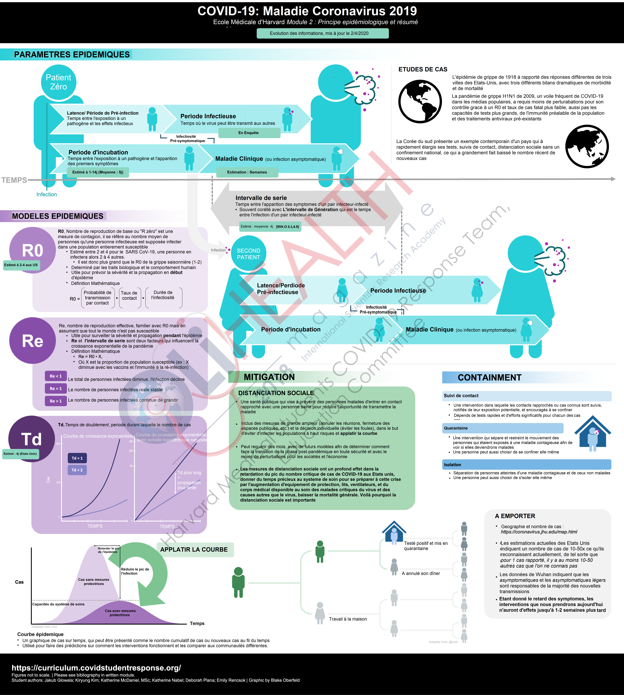

# French

## [Module 1 Summary](https://docs.google.com/document/d/1bXq8N3CVxeqSie9j4GL8CChIbbtnlX95QZfiXmBNgYA/edit?usp=sharing)

Translation courtesy: Wendy Demouge, Medical Student Besançon's Medical University \(wendy.demouge@gmail.com\) -Updated 04/09/20-

## Module 2 Graphic Summary

Translations courtesy of: Wendy Demouge, Medical Student Besançon's Medical University \(wendy.demouge@gmail.com\) and Vincent Georges, SNIR student Jules Haag High School for Informatics and Networks Besançon, France \(georges.vincent4@laposte.net\)                               -Updated 05/06/20-

