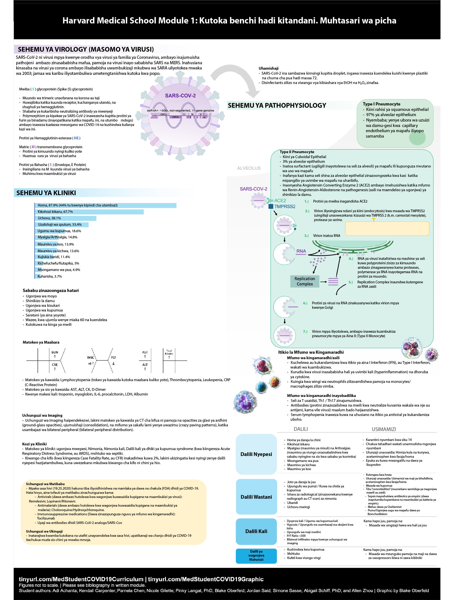
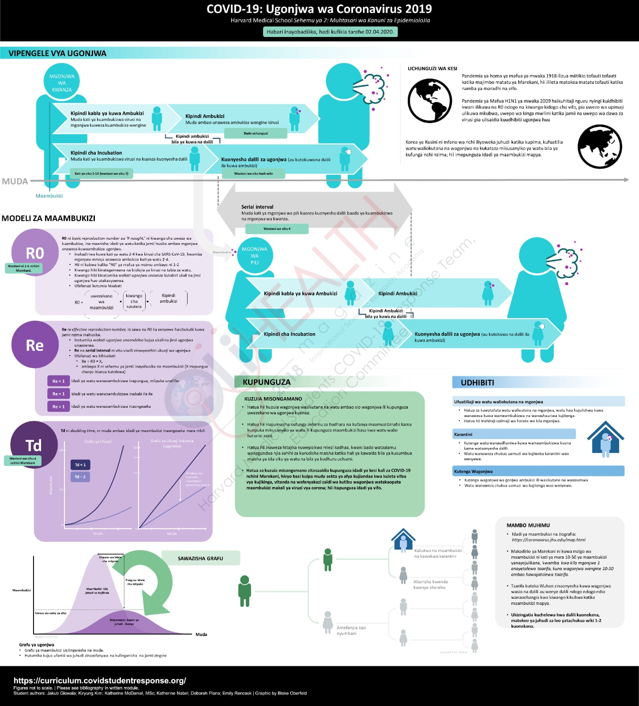

# Kiswahili

Translations on this page courtesy of Mohamed Al-Beity \(albeitymohamed@gmail.com\); Kalipa Kisuse \(mesh.r@hotmail.com\), Joshua Tadayo \(joshuatadayo@gmail.com\) \(with Oli Health Magazine\) - Updated 05/06/20 -

## [Module 1 Summary](https://drive.google.com/file/d/1wnu7beKdXiYNkmmRdagzV7RdhMd1JXra/view?usp=sharing)

## Module 1 Graphic Summary 

## [Module 2 Summary](https://drive.google.com/file/d/1YNYevnzNWZbgQwJwOkAddU-u3tl0ZEZX/view?usp=sharing)

## Module 2 Graphic Summary

