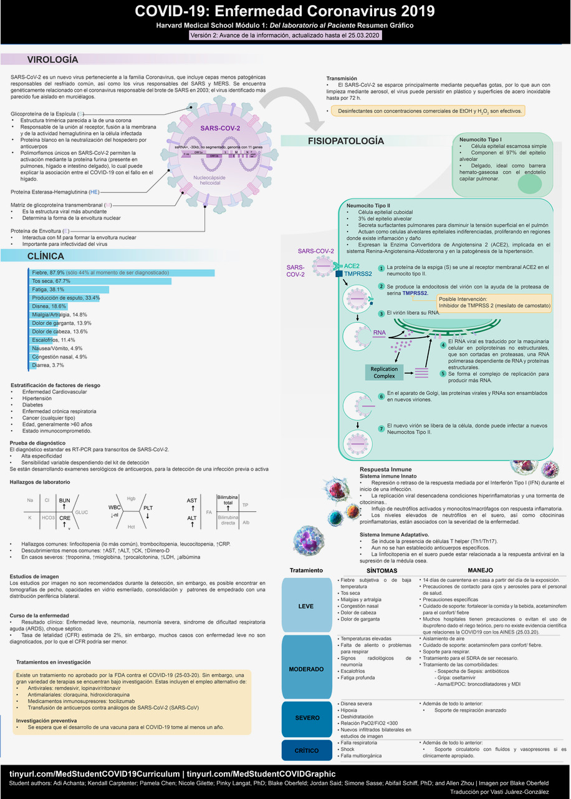

# Spanish

### Module 1 Graphic Summary

## [Abbreviated Modules 1-5 ](https://docs.google.com/document/d/1_f3P7jF1G0sl1LVx63eFsuBVEBF_aVZlSV5gZNauC2k/edit)

Translated by: Lorena Tora, M.D., Mitosis COVID19 response \(lorena@mitosishealth.org\)

