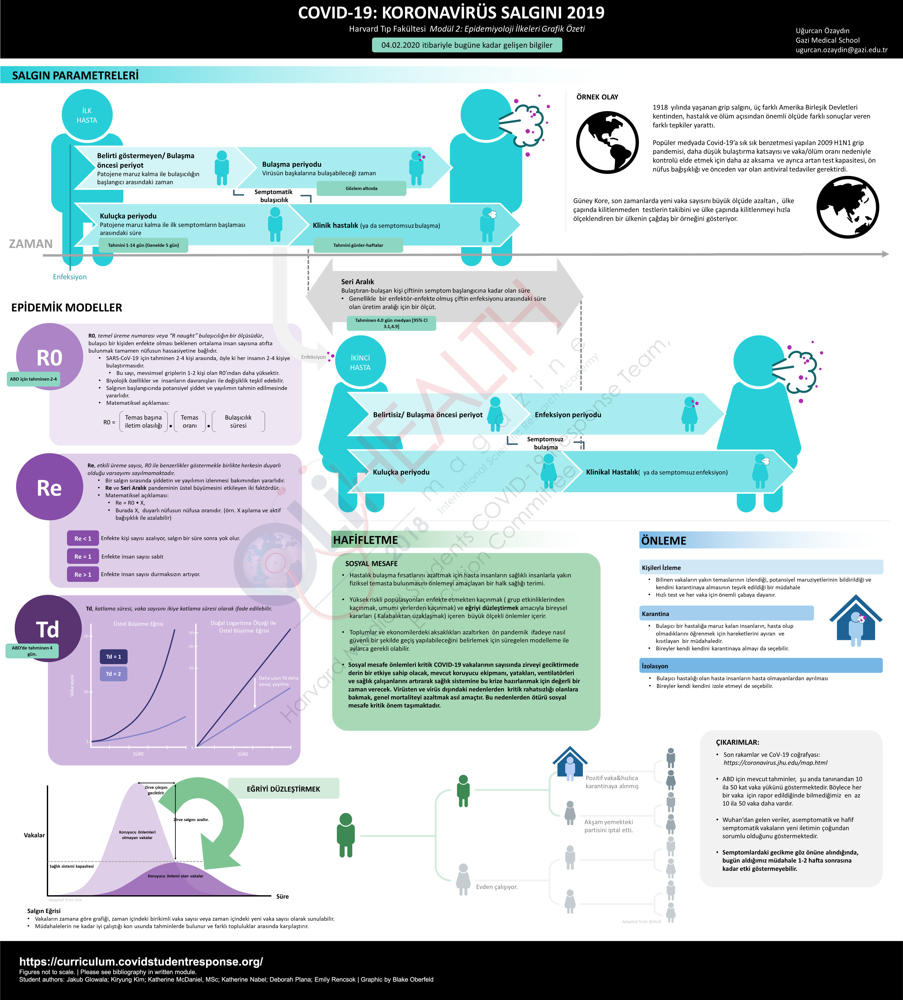

# Turkish

## Module 1 Graphic Summary

## [Module 1 Summary ](https://drive.google.com/file/d/1jXh6S9Jp_SxFu1eU5ad-sqTi-PyBqKET/view?usp=sharing)

## Module 2 Graphic Summary 

## [Module 2 Summary](https://drive.google.com/open?id=1kreTNVbkz30D8njAdB0D-Zjqw5ASPYqX) 

## [Module 3 Summary](https://drive.google.com/open?id=1mkiYsoePrPqZEf_vmVA10Xaq81irnNaF) 

## [Module 4 Summary ](https://drive.google.com/open?id=1o1vmQ-cvTfQf0XtE58FGz082CjFl7Kxm)

## [Module 5 Summary ](https://drive.google.com/open?id=1c2QyzX-L8R5fQ38Xgnp08O1kOeV6AkGJ)

## [Module 6 Summary](https://drive.google.com/open?id=1YXq783USRaeP7h-ngUyGdELjV7RnhA3z) 

## [Module 7 Summary](https://drive.google.com/open?id=1URPmOCbqNdSSGTlpbttFEKdnm5TIQhJ9) 

## [Module 8 Summary ](https://drive.google.com/open?id=16fcjo1IC-hkBI6lxtMDOYwZAro6Oif9g)

