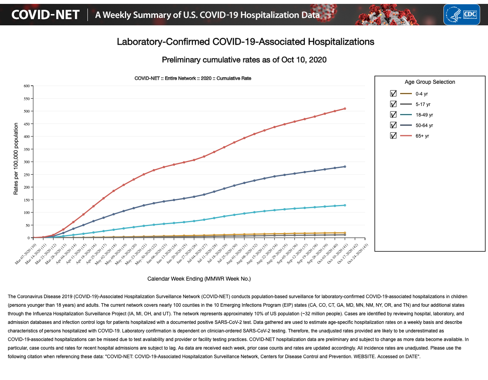

# Management of COVID-19

## Clinical Course

Once infected, the clinical course of COVID-19 in adults is variable, making both case identification and triage difficult. As discussed prior, both asymptomatic and presymptomatic transmission have been documented. For those who do become symptomatic, the incubation period \(time from exposure to symptom onset\) is 4-7 days on average \([Li et al. 2020](https://www.nejm.org/doi/10.1056/NEJMoa2001316?url_ver=Z39.88-2003&rfr_id=ori:rid:crossref.org&rfr_dat=cr_pub%3dwww.ncbi.nlm.nih.gov)\). For a minority of patients, the disease worsens approximately 5-10 days after symptom onset resulting in complications such as acute respiratory distress syndrome \(ARDS\), heart failure, coagulopathy, sepsis, acute cardiac injury, acute kidney injury, secondary infections, hypoproteinemia, and acidosis \([Zhou et al., Lancet 2020](https://www.thelancet.com/action/showPdf?pii=S0140-6736%2820%2930566-3); [Bhatraju et al., NEJM, 2020](https://www.nejm.org/doi/full/10.1056/NEJMoa2004500)\). This progression is visually represented by the slide below from Partners ID Grand Rounds Presentation summarizing the available literature on disease course \([Richterman and Meyerowitz, Partners ID Grand Rounds 3/25/20](https://docs.google.com/presentation/d/1shQ8m7kX2qFyj6PByY_DxM37fcyxLjSBojmTpFJN4kU/edit?usp=sharing)\). This demonstrates the late worsening that can be seen \([MGH Grand Rounds 3/12/20](https://externalmediasite.partners.org/Mediasite/Play/53a4003de5ab4b4da5902f078744435a1d); [Holshue et al., NEJM 2020](https://www.nejm.org/doi/full/10.1056/NEJMoa2001191); [Huang et al., Lancet 2020](https://www.thelancet.com/journals/lancet/article/PIIS0140-6736%2820%2930183-5/fulltext)\).

While the respiratory system is the most frequently affected organ systems, other prominently infected organ systems include the gastrointestinal, neurologic, hematologic and cardiovascular systems. The role of cardiac injury in disease progression remains unclear at this time; however, acute cardiac injury and fast-onset heart failure with reduced ejection fraction \(HFrEF\) may be playing an important role in the death of certain patients \([Shi et al., JAMA 2020](https://jamanetwork.com/journals/jamacardiology/fullarticle/2763524)\). The neurologic symptoms of COVID-19 that have been identified include dizziness, headache, altered mental status \([Mao, et al JAMA 2020](https://jamanetwork-com.ezp-prod1.hul.harvard.edu/journals/jamaneurology/fullarticle/2764549)\). Ischemic stroke has been noted in severe disease \([Helms et al, NEJM 2020](https://www.nejm.org/doi/full/10.1056/NEJMc2008597); [Iaccarino, et al. Am J Phys Med Rehabil 2020](https://journals.lww.com/ajpmr/Citation/9000/Neurological_Manifestation_of_COVID_19_and_the.97963.aspx)\). Whether these manifestations are a result of direct or indirect damage to the tissue remains to be elucidated.

A report from ambulatory clinics in Cambridge, MA suggests that in patients with mild disease being managed at home, dyspnea typically develops days after the onset of other symptoms and worsens with exertion. They highlight the 72 hours after the onset of dyspnea as a period for frequent check-in phone calls, as many patients will stay mildly dyspneic for 2 weeks and then recover but some will have a sudden worsening and require hospitalization \([Cohen et al, Mayo Clin Proc 2020](https://els-jbs-prod-cdn.jbs.elsevierhealth.com/pb/assets/raw/Health%20Advance/journals/jmcp/jmcp_ft95_4_8-1586804723267.pdf)\).

While most patients will eventually recover, a minority of patients will pass away from disease complications. For an in-depth discussion of case fatality rate, please see [Module 2](../module-2-epidemiology-principles/where-are-we-now.md#case-fatality-rate).

As discussed in “Clinical Presentation,” COVID-19 in children is often more benign disease course compared to adults. Children infected with COVID-19 are less likely to require hospitalization and ICU admission than their adult counterparts and have lower fatality rates \([CDC MMWR, 3.18.20](https://www.cdc.gov/mmwr/volumes/69/wr/mm6912e2.htm#F2_down); [Castagnoli et al., JAMA Pediatrics 2020](https://jamanetwork.com/journals/jamapediatrics/fullarticle/2765169?resultClick=1)\). However, one potential severe consequence of COVID-19 in pediatric patients is a a new entity called Multisystem Inflammatory Syndrome in children \(MIS-C\) \([Godfred et al, MMWR 2020](https://www.ncbi.nlm.nih.gov/pmc/articles/PMC7440126/)\). For a longer discussion of MIS-C, please reference the summary of COVID-19 and Children in the [supplemental materials](https://docs.google.com/document/d/1SsWujt6g1iNUAAPeOFjSP8YFaK_C48SSO_2iz0BcQi4/edit#heading=h.fzjmqy11md9f). 

_Thought questions:_

* Given the variable clinical course and outcomes in patients with COVID-19, how do we predict who will have more severe disease?
* What criteria could we use to determine who to admit to the hospital? What about admission to the ICU?

## **Risk Stratification** 

Numerous large cohort studies from China, US, and Italy have shown several common chronic conditions have prognostic implications for patients with COVID-19, including hypertension, type II diabetes, and cardiovascular \(as well as cerebrovascular\) disease \([China CDC Weekly, 2.10.20](https://pubmed.ncbi.nlm.nih.gov/32064853/), [CDC COVID-19 Response Team, MMWR 4.3.20](https://www.cdc.gov/mmwr/volumes/69/wr/mm6913e2.htm?s_cid=mm6913e2_w#F1_down), [Grasselli et al, JAMA 2020](https://jamanetwork.com/journals/jama/fullarticle/2764365)\). Numerous studies have shown that BMI, obesity are strongly correlated with increased risk of more serious COVID-19 infection outcomes; however, until recently, none have been able to establish a direct causative link between obesity and COVID-19 risk. Findings from a recent genetic analysis now show that people with genetic predisposition toward a higher BMI, LDL cholesterol, are significantly more likely to test positive for the virus [\(Aung et al., 2020\).](https://www.frontiersin.org/articles/10.3389/fgene.2020.586308/full) Additionally, NHS England formed a OpenSAFELY database containing information on 17.3 million citizens with a total of 10,926 deaths from COVID-19. Factors strongly associated with hospital related death confirmed some previous findings such as older age, male sex, uncontrolled diabetes, and severe asthma \([Williamson et al, Nature 2020](https://www.nature.com/articles/s41586-020-2521-4)\).  

It has also been noted that there is a disproportionate risk for infection and severe disease in racial minorities in the US. For an in depth discussion of the health disparities in COVID-19 Outcomes, see [Module 3](../module-3-disparities-policy-socioeconomic-effects/).  
  
“Elderly” age has been found to be an independent risk factor for both COVID-19 infection and a more serious disease course . While the precise age is up for debate, it is clear that the older a patient is \(particularly above 65 years of age\), the higher their mortality and ARDS risk is \([Wu et al, JAMA 2020](https://jamanetwork.com/journals/jamainternalmedicine/fullarticle/2763184)\). In addition to the increased mortality rate, older age has also been associated with increased need for hospitalization in the US \([COVID-NET CDC, 10.10.20](https://gis.cdc.gov/grasp/covidnet/COVID19_3.html)\). The following graph shows the COVID-19 related hospitalization rates per 100,000 people delineated by age group through June 6th, 2020. The CDC continually updates this data [here](https://gis.cdc.gov/grasp/covidnet/COVID19_3.html). Some have suggested that a composite score that takes into account both age and medical comorbidities, such as the Clinical Frailty Score \(CFS\) may more appropriately predict risk of severe disease than either factor alone. Frailty, a cornerstone of geriatric medicine, may have a role in both risk stratification and resource allocation as the pandemic unfolds, although more research is required to correlate this measure with clinical outcomes \([Hubbard et al., Age and Aging 2020](https://academic.oup.com/ageing/advance-article/doi/10.1093/ageing/afaa095/5831147); [Andrew et al., J Infect Dev Countr 2020](https://jidc.org/index.php/journal/article/view/32525825/2244)\).

Patients can be immunosuppressed for a variety of reasons including genetic immunodeficiencies, malignancies, and immunosuppressive medications used to manage a variety of medical conditions including transplants and rheumatologic conditions.  Data from a heart transplant cohort in China \(87 patients\) and a liver transplant cohort in Italy \(200 patients\) showed no increased risk of infection in these populations \([Ren et al, J Heart Lung Transpl 2020](https://www.sciencedirect.com/science/article/pii/S1053249820314698); [D’Antiga et al, Liver Transpl 2020](https://aasldpubs.onlinelibrary.wiley.com/doi/pdf/10.1002/lt.25756)\). A small study in France concluded that the type of immunosuppression may matter, with those who have hematologic malignancies being at highest risk for severe infection, although this trend did not reach statistical significance \([Razanamahery, J Infection 2020](https://www.journalofinfection.com/article/S0163-4453%2820%2930351-0/pdf)\). Larger scale studies are needed to determine if this theoretical risk represents a true risk in order to better guide clinical management decisions for patients on immunosuppressive medications. 

Interestingly, a recent genomewide association study showed that blood type A was a risk factor for more severe infection and blood type O was a protective factor. While this is an exciting and interesting finding, it is important to remember that correlation does not equal causation and that the nature of the relationship is poorly understood at this time \([Ellinghaus, NEJM 2020](https://www.nejm.org/doi/full/10.1056/NEJMoa2020283)\).

Risk factors for developing the neurologic complication of encephalopathy are being older, having severe COVID-19 disease, and having a prior history of any neurological disorder or chronic kidney disease \([Liotta et al, ACTN 2020](https://onlinelibrary.wiley.com/doi/epdf/10.1002/acn3.51210)\).

Data on COVID-19 risk factors and treatments continue to modify our current understanding of the virus and illness trajectory. Given available data, physicians have been able to devise new COVID-19 patient assessment systems, including the Dublin-Boston score which enables clinicians to make better informed decisions about treatment plans \([McElvaney et al., 2020\)](https://www.thelancet.com/journals/ebiom/article/PIIS2352-3964%2820%2930402-3/fulltext) . The test is based on patients’ inflammatory cytokine markers \(IL-6, IL-10\) which are linked to changes in the body’s immune response. This measure underscores the idea that COVID-19’s most severe effects are mediated through the body’s own inflammatory response.

## Triage Guidelines

This is one example of a triaging guideline in a fever clinic in Wuhan, China \(note that arbidol is an anti-influenza medication that is not used in the US; in the US, we may use oseltamivir instead\). This diagram is not meant to be used to guide treatment decisions, but to give an example of a method that has been used in fever clinics, triaging healthcare institutions, in Wuhan_._

\*\*\*\*

\([Zhang et al., Lancet Respir Med 2020](https://www.thelancet.com/journals/lanres/article/PIIS2213-2600%2820%2930071-0/fulltext)\)

The institution that you will be working at will have their own triage and treatment guidelines for emergency room providers and providers on the wards. As discussed in Imaging, the CDC and ACR currently do not support using chest x-ray or CT for diagnosis, due to poor specificity of these modalities \([ACR, 2020](https://www.acr.org/Advocacy-and-Economics/ACR-Position-Statements/Recommendations-for-Chest-Radiography-and-CT-for-Suspected-COVID19-Infection)\).

If a patient with risk of exposure to COVID-19 or confirmed COVID-19 calls phone triage, presents to urgent care, or to the ED, first identify whether they have no symptoms, mild symptoms, or moderate-severe symptoms.

* Mildly ill patients have subjective or low-grade fever, dry cough, aches and pains, nasal congestion, headache, sore throat \([Kirtz NPR 2020](https://www.npr.org/sections/goatsandsoda/2020/03/13/814691018/coronavirus-symptoms-defining-mild-moderate-and-severe); [WHO Department of Communication March 2020](https://www.who.int/publications-detail/clinical-management-of-severe-acute-respiratory-infection-when-novel-coronavirus-%28ncov%29-infection-is-suspected)\).
* Moderately ill patients have high-grade temperatures, shortness of breath/trouble breathing, chills, profound fatigue \([Kirtz NPR 2020](https://www.npr.org/sections/goatsandsoda/2020/03/13/814691018/coronavirus-symptoms-defining-mild-moderate-and-severe)\), and may have signs of pneumonia on imaging \([China National Health Commission](http://kjfy.meetingchina.org/msite/news/show/cn/3337.html)\)
* Severely ill patients have symptoms including severe dyspnea, hypoxia, dehydration \([Kirtz NPR 2020](https://www.npr.org/sections/goatsandsoda/2020/03/13/814691018/coronavirus-symptoms-defining-mild-moderate-and-severe)\). Signs include RR&gt;30, PaO2/FiO2&lt;300, imaging concerning for ARDS \(bilateral lung infiltrates within the last 1-2 days\) \([Casella et al. StatPearls March 2020](https://www.ncbi.nlm.nih.gov/books/NBK554776/)\)
* Critically ill patients will have frank respiratory failure, shock, and multiorgan failure \([Casella et al. StatPearls March 2020](https://www.ncbi.nlm.nih.gov/books/NBK554776/)\)

The categorization of mild, moderate, and severe symptoms of COVID-19 definitions may have overlap. The morbidity of disease should be considered on a case-by-base basis in the setting of the patient’s comorbidities and well-being as a whole.

Per the China CDC report of 72,314 cases, 81% of patients were mild/moderately ill, 14% were severely ill, and 5% were critically ill. There were no reports of deaths for patients who were mildly, moderately, or severely ill; there was a case fatality rate of 49% in critically ill patients \([Wu, McGoogan JAMA 2020](https://jamanetwork.com/journals/jama/fullarticle/2762130)\). 

_Thought question:_

* What questions would a clinician ask over the phone to get a sense of a patient's dyspnea or hypoxia?

### If Mildly Ill...

If a patient is calling on phone triage with only mild symptoms, try to assess if their symptoms can be managed with supportive care and self-isolation at home. A helpful tool for patients and providers for this determination is [https://c19check.com/](https://c19check.com/), an application made by providers at the Emory University School of Medicine.

Patients being evaluated in the ED with no symptoms or mild symptoms - who are not at risk of rapid decompensation and have reliable follow-up -  should be discharged from the ED with a set of careful return precautions, direction to self-quarantine, instruction for caregivers, and instruction for how to practice supportive care. A detailed guide by the CDC for COVID-19 triage, including a sample phone script for responders can be found using the [CDC Phone Advice Line Tool](https://www.cdc.gov/coronavirus/2019-ncov/hcp/phone-guide/index.html). Highlights of triage guidance are detailed below:

* Return precautions would be instruction to call a provider or 911 if they have trouble breathing, worsening symptoms, high fevers, etc. The patient should let the clinic or the 911 operator know about their current symptoms and their prior exposure to COVID-19 over telephone.
* Self-quarantine includes avoiding going to public places or events, staying at home \(preferably in a private room with a private bathroom\), wearing a face mask, and cleaning door knobs and other high touch household fixtures for at least 2 weeks after potential exposure; the decision to discontinue self-quarantine should be made with the help of healthcare providers \([CDC](https://www.cdc.gov/coronavirus/2019-ncov/hcp/guidance-prevent-spread.html)\). Per CDC guidelines, if patients had no symptoms but tested positive for COVID-19, they can end self-quarantine a week after their positive test - if they continue to be asymptomatic \([CDC](https://www.cdc.gov/coronavirus/2019-ncov/hcp/disposition-in-home-patients.html)\). For patients with mild symptoms, there are two strategies to discontinue self-quarantine, a test-based strategy \(only realistic when enough testing resources are available\) and non-test-based strategy \(which still prevents most secondary spread\):
  * Test-based strategy: All symptoms have resolved AND 2 confirmed negative results from nasopharyngeal swab molecular assays for COVID-19, collected 24 hours or more apart \([CDC](https://www.cdc.gov/coronavirus/2019-ncov/hcp/disposition-in-home-patients.html)\)
  * Non-test-based strategy: Patients with mild symptoms who were taking care of themselves at home can end self-quarantine 3 days after resolution of all symptoms AND if it has been over 10 days since they first started having symptoms \([CDC](https://www.cdc.gov/coronavirus/2019-ncov/hcp/disposition-in-home-patients.html)\)
* Supportive care involves making sure the patient is eating and drinking well, and taking acetaminophen for comfort and fever reduction \([WHO Department of Communication March 2020](https://www.who.int/publications-detail/clinical-management-of-severe-acute-respiratory-infection-when-novel-coronavirus-%28ncov%29-infection-is-suspected)\)
  * The effects of NSAIDS on COVID-19 disease severity remain controversial \([BMJ](https://www.bmj.com/content/368/bmj.m1086) News\). The WHO \([WHO Twitter](https://twitter.com/WHO/status/1240409217997189128) 3/18/2020\) and the European Medicines Agency \([EMA Press 3/18/2020](https://www.ema.europa.eu/en/news/ema-gives-advice-use-non-steroidal-anti-inflammatories-covid-19)\) do not support the avoidance of ibuprofen/NSAIDs as there is no good evidence establishing a link between NSAIDs and worsening of COVID-19 severity \([WHO Scientific Brief, April 2020](https://www.who.int/news-room/commentaries/detail/the-use-of-non-steroidal-anti-inflammatory-drugs-%28nsaids%29-in-patients-with-covid-19)\). A more recent Danish nationwide study showed no association between NSAID use and adverse outcomes such as 30-day mortality, hospitalizations, ICU admissions, and mechanical ventilation among those who tested positive for COVID-19 \([Lund et al. Plos Medicine September 2020](https://journals.plos.org/plosmedicine/article?id=10.1371/journal.pmed.1003308)\). However, due to an abundance of caution, the easy availability of alternatives \(ex. acetaminophen\), and the theoretical risk that NSAIDs may pose \([Fang et al. Lancet March 2020](https://www.thelancet.com/journals/lanres/article/PIIS2213-2600%2820%2930116-8/fulltext)\), many hospitals, including MGH, are avoiding NSAIDs until more definitive data emerges.If NSAIDs are used, the lowest effective dose is recommended \([MGH COVID-19 Treatment Guidance](https://www.massgeneral.org/assets/MGH/pdf/news/coronavirus/mass-general-COVID-19-treatment-guidance.pdf)\).

Patients with a high risk of exposure to COVID-19 or confirmed COVID-19, but with only mild symptoms, should be admitted if there is risk they will decompensate or do not have reliable follow-up. Other considerations for admission are if there are others at the patient’s residence who are at high risk of complications from COVID-19, if your patient doesn’t have access to necessary resources and personal protective equipment at home, and if your patient is unable to self-quarantine \([CDC](https://www.cdc.gov/coronavirus/2019-ncov/hcp/guidance-prevent-spread.html)\). 

Thus far, there is very limited data for care for pregnant women with COVID-19 and for post-partum care. Routine antenatal care continues to be encouraged. Individuals with high suspicion of COVID-19 or confirmed disease who are breastfeeding or having skin-to-skin contact with their infants should wear masks as appropriate and wash their hands before and after touching the baby. Please see the WHO clinical treatment guidelines for further details: [WHO Dept of Communication March 2020](https://www.who.int/publications-detail/clinical-management-of-severe-acute-respiratory-infection-when-novel-coronavirus-%28ncov%29-infection-is-suspected).

_PPE Guidelines by the CDC_

When caring for patients with a URI of unspecified etiology or with suspected COVID-19 infection in the ED, providers are recommended to use droplet precautions \(face mask or respirator\), contact precautions, and eye protection. If these materials are disposable, they should ideally be discarded after the provider leaves the room. Patients should also be given droplet masks to wear throughout their visit if possible \([CDC COVID-19 PPE guidelines](https://www.cdc.gov/coronavirus/2019-ncov/infection-control/control-recommendations.html)\). If facemasks are not available for patients, homemade masks can also be used, although proper caution should be taken as these masks could also become contaminated and serve as a source of transmission to others \([CDC COVID-19 Standard of Procedure for Triage](https://www.cdc.gov/coronavirus/2019-ncov/hcp/non-us-settings/sop-triage-prevent-transmission.html#:~:text=A%20standardized%20triage%20algorithm%2Fquestionnaire,19%20given%20the%20global%20pandemic.)\).

Airborne precautions \(ex. N95 respirators\) should be used if providers are planning to intubate, administer HFNO or CPAP/BiPAP, obtain a nasopharyngeal swab, or perform other procedures that may generate aerosols \([CDC COVID-19 PPE guidelines](https://www.cdc.gov/coronavirus/2019-ncov/infection-control/control-recommendations.html)\). In settings of PPE scarcity, please follow your institution’s guidelines; these may involve using PPE for an entire shift or reusing it unless the PPE becomes wet or visibly soiled.

For more information on PPE, please see [Module 6](../module-6-training-for-clinical-roles/personal-protective-equipment.md).

### If Moderately, Severely, or Critically Ill...

It is important to admit patients who are moderately, severely, or critically ill. The decision about whether or not to manage patients on the floor versus admit patients to the ICU is ideally dependent on a patient’s medical stability. ICU level care is needed for patients who are at high risk of decompensation, who need advanced ventilatory support, or who need support for 2+ systems \(neurologic, renal, respiratory, circulatory\). For patients with COVID-19, the patients at most risk for needing ICU level care are older patients and patients with comorbid conditions such as COPD, hypertension, cardiovascular disease, and diabetes mellitus \([Smith, Nielsen BMJ 1999](https://www.ncbi.nlm.nih.gov/pmc/articles/PMC1115908/)\). The most likely need for ICU admission in this patient population is advanced respiratory support \([Murthy et al. JAMA Insights 2020](https://jamanetwork.com/journals/jama/fullarticle/2762996)\). Patients should be admitted if in or at risk for hypercarbic or hypoxic respiratory failure, are having or have had recent seizures, if they are at risk for losing their airway, or if they are in shock, etc. It is also important to note whether your patient had previously noted wishes about not receiving ICU level care in an advanced directive \([Smith, Nielsen BMJ 1999](https://www.ncbi.nlm.nih.gov/pmc/articles/PMC1115908/)\).

## Treatment

[Infectious Disease Society of America \(IDSA\)](https://www.idsociety.org/practice-guideline/covid-19-guideline-treatment-and-management/) keeps an up-to-date list of complete treatment/management recommendations. The following is a summary of measures used for treatment of admitted patients who are moderately, severely, or critically ill but should not be used for direct patient management, please consult IDSA and hospital guidelines to inform clinical decisions:

* Hospitalization for routine monitoring of vitals
* Use National Early Warning Score \([Smith et al. Resuscitation 2013](https://www.resuscitationjournal.com/article/S0300-9572%2818%2930945-6/fulltext); [MDCALC](https://www.mdcalc.com/national-early-warning-score-news#evidence)\), warning scores, to predict if a patient will decompensate
* If the patient is undergoing procedures that generate aerosols \(sputum production, intubation, HFNO, BiPAP/CPAP, etc.\), isolate the patient in a single private negative pressure isolation room with HEPA filter to minimize risk of airborne transmission
  * If unable to provide airborne infection isolation room, be extremely cautious in giving patient airway devices that deliver 6L/min or more of oxygen \(if not intubated\) as this may generate aerosols \([Cheung Lancet Respir Med 2020](https://www.ncbi.nlm.nih.gov/pubmed/32105633), [Brewster et al. Medical Journal of Australia 2020](https://onlinelibrary.wiley.com/doi/full/10.5694/mja2.50598)\)
  * High flow nasal oxygen can give fraction of inspired oxygen \(FiO2\) up to 100% and reduces the need for intubation, but should be used with airborne precautions as it may produce aerosols \([WHO Department of Communication March 2020](https://www.who.int/publications-detail/clinical-management-of-severe-acute-respiratory-infection-when-novel-coronavirus-%28ncov%29-infection-is-suspected)\)
  * BiPAP and CPAP may also generate aerosols and should be avoided if possible, or used with caution if necessary \([WFSA Coronavirus Guidance](https://www.wfsahq.org/resources/coronavirus)\)
  * If a private room is not possible, keep 2+ feet distance between patients \([Murthy et al. JAMA Insights 2020](https://jamanetwork.com/journals/jama/fullarticle/2762996)\)
* If concomitant asthma or COPD, to give bronchodilators, use metered dose inhalers with a spacer instead of nebulizers due to risk of aerosolization \([Wax, Christian Can J Anesth 2020\)](https://link.springer.com/article/10.1007%2Fs12630-020-01591-x#citeas)
  * If patient has severe asthma or COPD, consider epinephrine and early rapid sequence intubation
* Consult Infectious Disease and Pulmonology services early if not already involved
* Use standard DVT prophylaxis \([MGH COVID-19 Treatment Guidance](https://www.massgeneral.org/assets/MGH/pdf/news/coronavirus/mass-general-COVID-19-treatment-guidance.pdf)\)
* Conservative fluid management--defined as net fluid balance of 0mL over the first 7 days-- if patient has been diagnosed with ARDS and is not hypotensive or in shock \([FACT trial NEJM 2006](https://www.nejm.org/doi/full/10.1056/NEJMoa062200)\)
* If suspecting sepsis, give empiric antibiotics \(for community acquired pneumonia vs healthcare associated pneumonia\) within 1 hour of recognition of sepsis, and then work-up source of infection
* Consider oseltamivir in flu season or if you have a high suspicion that your patient has comorbid flu
* Strongly consider advanced ventilatory support/intubation if a patient is in respiratory failure \(hypercarbic or hypoxic\); for intubation specifics, please check out this [link](https://docs.google.com/document/d/1SsWujt6g1iNUAAPeOFjSP8YFaK_C48SSO_2iz0BcQi4/edit#bookmark=id.q0levkbf899a)
* For a quick summary review of ventilatory settings for ARDS treatment, please check out this [link](https://docs.google.com/document/d/1SsWujt6g1iNUAAPeOFjSP8YFaK_C48SSO_2iz0BcQi4/edit#bookmark=id.8ldb2jkztow5); for more detailed information about the pathophysiology of ARDS and instruction about the basic operations of ventilators, please read the relevant sections of [Module 6](../module-6-training-for-clinical-roles/mechanical-ventilation-the-basics.md). 
* The Society of Critical Care Medicine \(SCCM\), American Association for Respiratory Care \(AARC\), American Society of Anesthesiologists \(ASA\), Anesthesia Patient Safety Foundation \(ASPF\), American Association of Critical‐Care Nurses \(AACN\), and American College of Chest Physicians \(CHEST\) have released a joint statement to advise against sharing one ventilator amongst multiple patients due to the current technological limitations in being able to do so safely \([APSF March 2020](https://www.apsf.org/news-updates/joint-statement-on-multiple-patients-per-ventilator/?utm_source=facebook&utm_medium=paidsocial&utm_campaign=2020+Automated+Promoted+Posts&fbclid=IwAR2acGhsp4TvtBAjMbhJMfMAwOSDBzYehocxCZje6YJZ9trwRdN6iSxB50s)\).
* If patients have refractory hypoxemia even with advanced ventilatory support, consider extracorporeal membrane oxygenation \(ECMO\) if available \([WHO Department of Communication March 2020](https://www.who.int/publications-detail/clinical-management-of-severe-acute-respiratory-infection-when-novel-coronavirus-%28ncov%29-infection-is-suspected); [Ramanathan et al., Lancet Resp Med 2020](https://www.thelancet.com/journals/lanres/article/PIIS2213-2600%2820%2930121-1/fulltext); [Combes et al., NEJM 2018](https://www.nejm.org/doi/10.1056/NEJMoa1800385)**\)**
* Treat shock with volume support and pressors - norepinephrine as a first-line agent, vasopressin as a second-line agent is recommended; dopamine is not recommended \([Poston, Patel, Davis JAMA 2020](https://jamanetwork.com/journals/jama/fullarticle/2763879)\).
* Dexamethasone is recommended for patients requiring supplemental oxygen or invasive mechanical ventilation. The RECOVERY trial showed 28-day mortality benefit among those receiving mechanical ventilation or supplementalO2 but did not show mortality benefit for those not requiring oxygen support \([RECOVERY trial, NEJM 2020](https://www.nejm.org/doi/full/10.1056/NEJMoa2021436); [rebelEM summary](https://rebelem.com/the-recovery-trial-dexamethasone-for-covid-19/)\). These findings were further corroborated by a meta-analysis of seven randomized trials analyzing the impact of steroid therapy on mortality in severely ill COVID-19 patients \(REACT Working Group, [JAMA 2020](https://jamanetwork.com/journals/jama/fullarticle/2770279)\).
* Short-term and long-term effects of ACEi/ARB therapy on COVID-19 risk and outcomes is still unclear \([Sommerstein et al. JAHA April 2020](https://www.ahajournals.org/doi/10.1161/JAHA.120.016509)\). The current recommendations from a number of professional societies, is to continue ACEi/ARB therapy during treatment of COVID-19 unless there is a contraindication. Furthermore, it is not recommended to start ACEi/ARB therapy explicitly for treatment of clinical sequelae from COVID-19. Clinical trials for the use of losartan therapy for COVID-19 are currently underway \([Bavishi et al. JAMA Cardiol. April 2020](https://jamanetwork.com/journals/jamacardiology/fullarticle/2764299)\).
* The ACTT-1 study demonstrated that remdesivir was effective as compared to placebo in shortening the time to recovery in adults who were hospitalized with COVID-19 and had evidence of lower respiratory tract infection \([NEJM Oct 2020](https://www.nejm.org/doi/full/10.1056/NEJMoa2007764?query=featured_home)\). The IDSA presently recommends the use of remdesivir for COVID patients with SpO2 ≤94% on room air, and those who require supplemental oxygen, mechanical ventilation, or ECMO \([IDSA COVID Treatment Guidelines](https://www.idsociety.org/practice-guideline/covid-19-guideline-treatment-and-management/#toc-8)\). The FDA has [approved](https://www.fda.gov/news-events/press-announcements/fda-approves-first-treatment-covid-19) the use of remdesivir in COVID-19 cases requiring hospitalization. However, the use of remdesivir continues to be controversial with the WHO releasing [recommendations](https://www.who.int/publications/i/item/therapeutics-and-covid-19-living-guideline) against its use.

Please take a look at this link for up-to-date recommendations about how resources and space should be managed in ED and ICU settings: [University of Washington](https://em.uw.edu/faculty/uw-department-emergency-medicine-edicu-covid-19-preparedness?fbclid=IwAR1nn6Y0h_mQ22F7Bt0tZHnNoivvXNcJNdpyhVcB4C7aGOrRt-3YPMgWiOU) 

Continue reading “Investigational Therapeutics” for information on the scientific basis for many of these experimental therapies. 

_Thought questions:_

* How do you personally balance the benefits vs risks of high flow nasal oxygen delivery? Would you use this treatment modality? In which situations?
* What signs/symptoms/imaging findings would prompt you to think about giving empiric antibiotics?
* Given what you have learned previously about corticosteroids \([a very nice visual review here!](https://www.youtube.com/watch?v=sSP6QrTvPlo)\), why may they be detrimental to treatment of viral pneumonia? Under what circumstances may a patient with COVID-19 be considered for corticosteroid treatment?

