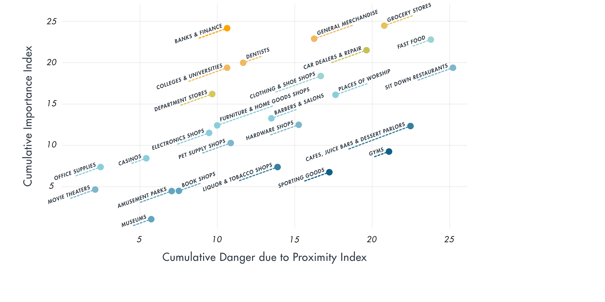

# Approaches to Long-Term Planning

Governments worldwide are trying to plan for the next 1-2 years before a vaccine is available \(for the latest on vaccine development, see [Module 1](https://curriculum.covidstudentresponse.org/module-1-from-bench-to-bedside/investigational-therapeutics-and-vaccine-development)\). A number of models have emerged to help with this task - some focused just on resource demands in the next few months \(e.g. [Murray, medRxiv 2020](https://www.medrxiv.org/content/10.1101/2020.03.27.20043752v1.full.pdf)\), others aimed at the next 18-24 and incorporating consideration of a second wave in the fall-winter \(e.g. [Kissler & Tedijanto et al, Science, 4.14.20](https://science.sciencemag.org/content/early/2020/04/14/science.abb5793)\). Modeling on these timescales requires making a number of assumptions and is therefore fraught with uncertainty, as detailed in this [article](https://fivethirtyeight.com/features/why-its-so-freaking-hard-to-make-a-good-covid-19-model/) \([Koerth et al., 538 2020](https://fivethirtyeight.com/features/why-its-so-freaking-hard-to-make-a-good-covid-19-model/)\). Nevertheless, modeling has helped the scientific community to explore two main long-term approaches, which we will call “**long-term mitigation**” and “**suppression**.” Long-term mitigation would involve sustained or intermittent social distancing until herd immunity is reached or a vaccine is available. Suppression would identify and isolate cases until a vaccine is available. Suppression requires bringing case numbers down in the short term, and then excellent testing and contact tracing infrastructure.

## **Long-Term Mitigation**

Many governors and mayors around the country have implemented policies in recent weeks promoting social distancing for their states/cities \(closing bars and restaurants, moving schooling online, banning public gatherings, etc\). As of March 16th, the CDC and the White House recommended canceling events expected to host at least [10 people](https://www.whitehouse.gov/wp-content/uploads/2020/03/03.16.20_coronavirus-guidance_8.5x11_315PM.pdf). As of April 3rd, the majority of states have already implemented or are strongly considering shelter-in-place precautions for their citizens, meaning that individuals must stay home except to conduct essential activities related to health, work, food and exercise. These initiatives help to flatten the curve, decreasing the peak number of COVID-19 cases and increasing the length of the pandemic. Yet they come at a substantial economic and social cost, including increased rates of unemployment, which will likely in themselves impact population health in the long term. 

If social distancing and lockdowns are our sole response to the pandemic, they will require many months of participation to be effective. An [Imperial College report](https://www.imperial.ac.uk/media/imperial-college/medicine/sph/ide/gida-fellowships/Imperial-College-COVID19-NPI-modelling-16-03-2020.pdf) \(analysis specific to the U.S. is found on page 19\) suggests that social distancing needs to be maintained “until a vaccine becomes available \(potentially 18 months or more\)” in order to actually decrease deaths from COVID-19 in the long run. Furthermore, mortality rates will certainly be worsened if the healthcare system is overwhelmed and unable to provide appropriate care to all who need it. Lifting lockdowns and social distancing restrictions immediately once the curve is flattened will essentially release the virus back into a population without immunity; creative methods, such as stratified lockdowns or alternating open and closed periods \(intermittent social distancing\) to increase herd immunity would be necessary to ensure prevention of a second viral outbreak [\(Hernán, 3.15.20\)](https://twitter.com/_MiguelHernan/status/1239227279512829953). 

A recent Harvard study \([Kissler & Tedijanto et al, Science, 4.14.20](https://science.sciencemag.org/content/early/2020/04/14/science.abb5793)\) modeled the effects of intermittent social distancing, periods of enforced social distancing with alternating periods of lifted restrictions, on the spread of COVID-19 and impact on hospital systems in the US. This analysis indicates that there will likely be recurrent outbreaks after the initial pandemic wave once social distancing measures are lifted. The authors aim to develop models to allow for maintenance of the flattening of the curve in addition to beginning to open the economy. The study finds that, given current US hospital capacity, intermittent social distancing could need to be prolonged to 2022, with social distancing restrictions in place between 25% and 75% of the time. The majority of the models in the analysis allow for 1-2 months of social distancing followed by 1-2 months of re-openings for the next 2 years.

It is important to note that the Imperial College model and the Harvard study mentioned above do not take into account the implementation of new therapeutic and vaccine options \(such as remdesivir and other antivirals, viral proteins and mRNA vaccine approaches described in Module 1\) that might become widely available to treat COVID-19 in the coming months. Nor do they account for expansion of health care facilities, for instance allowing time to make more ventilators to manage the surge. The Imperial College study acknowledges that as case numbers come down it will become easier to carry out expanded testing with robust contact tracing and isolation. These approaches form the foundation of the suppression approach as detailed in the next section. 

As we have discussed, social distancing, both prolonged one-time and intermittent, buys the healthcare system time to adapt to the outbreak. Importantly, social distancing also buys physicians and scientists time to test and optimize the efficacy of new therapies to treat COVID-19 patients, thereby reducing the percent of those patients requiring critical care and the disease mortality. As we face the long term, however, we may aim to target interventions more precisely - progressing from mitigation to suppression. 

## **Suppression**

Mitigation is a blunt tool: without knowledge of who has COVID-19 and who does not, everyone must adopt social distancing measures and society grinds to a halt. The suppression strategy, by contrast, identifies those who have or are at risk for having the virus and keeps them away from others while infectious. This fine targeting is meant to keep the Re below 1 while releasing the rest of society to resume activity, even without herd immunity. 

South Korea is the exemplar of this strategy, as detailed in the South Korea [case study](https://curriculum.covidstudentresponse.org/module-2-epidemiology-principles/case-study-south-korea-2020). With massive testing, contact tracing, and strictly enforced quarantines and isolations they have been able to control their outbreak without resorting to mandatory shutdowns. As of April 10th they report [epidemiological links](https://www.cdc.go.kr/board/board.es?mid=a30402000000&bid=0030) for over 80% of their confirmed cases, evidence that they have been able to track the extent of the outbreak closely. Using these strategies, as of April 10th, South Korea reports 0 new cases in Daegu, the region that was once the epicenter of South Korea’s COVID-19 outbreak. However, even with broad testing, contact tracing, and quarantine, South Korea continues to see a rise in their imported cases. This rise emphasizes the need for global cooperation in suppressing the outbreak.

As of April, other Asian countries that were successful in containment initially are similarly seeing a second wave of the outbreak due to imported cases. One example is Singapore, where the number of cases remained below 200 in mid-March despite being in close physical and social proximity to the center of the outbreak, China. Singapore was one of the first countries to ban travel from China, doing so at the end of January, and deployed strict contact tracing and quarantine of cases. However, as of April 23, their cases have spiked to greater than 10,000 cases, and are [spreading fast](https://www.nytimes.com/2020/04/20/world/asia/coronavirus-singapore.html?action=click&module=Spotlight&pgtype=Homepage) amongst the migrant foreign laborers who had been neglected. The exponential rise in cases amongst migrant workers has been compounded by the inability to quarantine effectively, as these workers live in cramped dormitory housing with more than 20 people per single room.

A number of public health advocates are pushing the U.S. to adopt the suppression approach \([Jha and Carroll, Atlantic 3.17.20](https://www.theatlantic.com/ideas/archive/2020/03/how-we-beat-coronavirus/608389/)\). They turn to both federal and state policy-makers and are asking the [business community](https://www.forbes.com/sites/steveforbes/2020/04/08/to-get-our-economy-moving-focus-on-testing-for-coronavirus/) to support the same. We find the clearest explanation of what this strategy would require and why it matters in the following resource, working from data publicly available in mid-March. The main points are summarized below and the full text is linked here:

**CORE TEXT:** [**Pueyo, T. Coronavirus: The Hammer and the Dance.**](https://medium.com/@tomaspueyo/coronavirus-the-hammer-and-the-dance-be9337092b56) **Medium, 3.19.2020.**

### **Suppression Strategy: Hammer and the Dance**

The “**hammer**” is a short-term total mandatory shutdown of all activities such as schools, churches, social venues and other non-essential businesses, and instituting travel bans internationally and domestically with economic assistance to allow mandatory quarantine for all people. This is what Italy, Spain and France are currently doing to control their outbreaks. The goal is to reduce Re to below 1 as quickly as possible, stop infections from growing exponentially, and then transition to the “dance” phase. 

The hammer gives us time - to scale up testing and tracing capacities, increase healthcare capacities including increasing production of necessary PPE and equipment, improve treatments, understand the true number of cases and learn more about the virus and the disease. 

The severity of the hammer will depend on how long we waited to institute effective interventions to mobilize the government, educate the public, and detect and isolate cases. The bigger the outbreak is, the more severe the hammer needs to be to catch up. The lesson for countries who are just now seeing the rise in cases is to implement cheaper interventions early on, to avoid having to shut down with severe economic consequences. \(See chart below for examples of cheaper and more expensive non-pharmaceutical interventions, with detail on various representative country responses.\)

After the initial intense effort to get Re below 1, the **dance** aims to keep Re below 1 with a combination of cheaper strategies while relaxing the severe restrictions. These strategies include:  
1. Measures to detect the true extent of the outbreak including widespread testing, contact tracing, strict quarantining and isolating of detected cases.  
2. Continuing public education on social distancing and hygiene.  
The restrictions can be tightened and loosened, based on how the outbreaks evolve. Transitioning to the dance requires that we have the capacity to support hospital systems in time of surge so that localized and concentrated efforts can be delivered when new outbreaks arise.

The question echoing in the media, “When can we reopen?” is another way of framing the safe transition from the “hammer” to the “dance.” One excellent response for U.S. states advises a series of pre-conditions for re-opening that reflect the strategies above. These are: 1\) adequate hospital capacity to treat all patients requiring hospitalization without resorting to crisis standards of care; 2\) ability to test at least everyone who has symptoms; 3\) ability to conduct monitoring of confirmed cases and contacts; 4\) sustained reduction in cases for at least 14 days \([Carroll, NY Times, 4.6.20](https://www.nytimes.com/2020/04/06/upshot/coronavirus-four-benchmarks-reopening.html)\).

## Reopening

As all 50 states in the U.S. reopen and ease social distancing policies, the frequency, intensity and scope of human interaction will inevitably increase. The three major factors of the [basic reproduction number, R0](https://curriculum.covidstudentresponse.org/module-2-epidemiology-principles/introduction-to-epidemiological-terms), are contact rate, transmission risk per contact, and duration of infectiousness. Reopening increases contact rate and hence increases the probability of the virus spreading.  Understanding the epidemiological principles behind the [transmission dynamics](https://curriculum.covidstudentresponse.org/module-1-from-bench-to-bedside/basic-virology-and-immunology) of the virus allows us to use non-pharmaceutical interventions to reduce the risk of transmission. For example, transmission risk per contact could be reduced through proper use of [personal protective equipment](https://curriculum.covidstudentresponse.org/module-6-training-for-clinical-roles/personal-protective-equipment), avoiding close contact with others, or meeting outside where air circulation is better. Contact rate could be reduced by limiting gathering size or avoiding unnecessary in-person meetings. Reducing the duration of infectiousness can be accomplished by getting tested to receive an early diagnosis and self-quarantining. Detailed risk measurements vary by situations and activities, but the same principles and cautiousness should be consistently applied.

### **Testing to Determine Immune vs Susceptible Populations** 

Recall that there are two main tests available for COVID-19: serology and Reverse Transcriptase Polymerase Chain Reaction \(RT-PCR\). Briefly, serology testing is used to determine whether an individual has had an active COVID-19 infection in the past, since it tests for antibodies against SARS-CoV-2, the virus that causes COVID-19. RT-PCR, on the other hand, is used to test for active infection of SARS-CoV-2. More information can be found in[ Module 1](https://curriculum.covidstudentresponse.org/module-1-from-bench-to-bedside/clinical-presentation-of-covid-19#molecular-assays).

As states in the US continue to reopen, testing, especially RT-PCR, is being used to detect both asymptomatic and symptomatic cases with high accuracy. Many institutions are planning to reduce risk of transmission by providing [test kits](https://www.questdiagnostics.com/dms/Documents/covid-19/COVID19_Specimen_Collection_Device_Guidelines/COVID19%20Specimen%20Acceptability_LDT%20Roche%20Revised%20Version%20v4%2032020.pdf) on a regular basis that allow individuals to self-acquire samples via, for example, the anterior nares, to send to a high-throughput facility in a CLIA-certified lab to process the RT-PCR tests. More details can be found in[ Module 1](https://curriculum.covidstudentresponse.org/module-1-from-bench-to-bedside/clinical-presentation-of-covid-19#united-states-testing-capacity). Some reopening institutions are also requiring individuals to [report symptoms](https://covid.joinzoe.com/us) of COVID-19 on a regular basis and have plans to implement [contact tracing](https://time.com/5825140/what-is-contact-tracing-coronavirus/) for rapid identification of those who might have been in contact with an infected person. All these efforts are important proactive and reactive measures to take to reduce the spread of the virus.

Testing, symptoms reporting, and contact tracing can all inform the behaviors of infected individuals and reduce the risk of transmission and contact rate, which decreases the estimated contagiousness \(R0\) of SARS-CoV-2. Testing for SARS-CoV-2 antibodies via serology can also help to identify individuals who have already acquired immunity to SARS-CoV-2. This decreases the estimated contagiousness of the virus factoring in the decreased size of susceptible  populations \(Re\). More information on R0 and Re can be found in the previous section [Introduction to Epidemiological Terms](https://curriculum.covidstudentresponse.org/module-2-epidemiology-principles/introduction-to-epidemiological-terms#epidemic-parameters). 

### Risk Stratification of Activities

Different activities and interactions have various levels of risk for infection. Risks for different activities can be accessed from: 1\) Contact intensity; how close you are in contact with people for how long, 2\) Number of contacts, and 3\) Mitigation measurements; steps taken to minimize risk of exposure. Exposures to different social activities and environments carry varying relative levels of transmission risk \(see figure below for more details\). More detailed advice for different daily activities like commuting and going to restaurants can be found in the article [Safety Advice for Reopening: How to Reduce Your Risks as Coronavirus Lockdowns Ease](https://www.wsj.com/articles/safety-advice-for-reopening-how-to-reduce-your-risks-as-coronavirus-lockdowns-ease-11588510800).

Risk benefit analysis of activities stratified on importance of location and risk of SARS-CoV-2 transmission, from [Benzel, et al., SSRN, 04/20/20](https://papers.ssrn.com/sol3/papers.cfm?abstract_id=3579678).

These principles apply during public gatherings as well. In protests, for example, attendees should stay home if feeling sick and bring protective equipment for themselves \(masks, hand sanitizer, eye protection\). During the protest, attendees can reduce risk by masking, maintaining physical distance from others not in their pod, and minimizing additional aerosol production by avoiding shouting. They should avoid touching their faces. After returning home, they should wash their hands and sanitize all items with. The recommendation is to test or self-quarantine for 14 days afterward. Refer to [How to Protest Safely During the COVID-19 Pandemic](https://www1.nyc.gov/assets/doh/downloads/pdf/imm/covid-19-safe-protest.pdf) and [How to more safely protest in a pandemic](https://www.vox.com/2020/5/31/21276082/what-to-bring-to-a-protest-coronavirus-covid-19-risk-safety) for more detailed advice.  
  

_Thought Questions:_

1. Current models estimate that social distancing measures might need to be implemented for years, not months, to slow the spread of the virus and its impact on our healthcare system. How will our society need to adapt to these long-term changes?
2.  How do we make sure vulnerable populations \(including families dependent on jobs unable to be adapted to remote work\) are adequately supported during this time?
3. How do you think the general public would respond to intermittent social distancing if it were implemented? Some ideas to consider: compliance with social distancing restrictions as time goes on, view of the importance of social distancing as restrictions are continually lifted and put back in place, effects on businesses needing to close and reopen, what messaging would need to come from the government/academic leaders, etc.  

