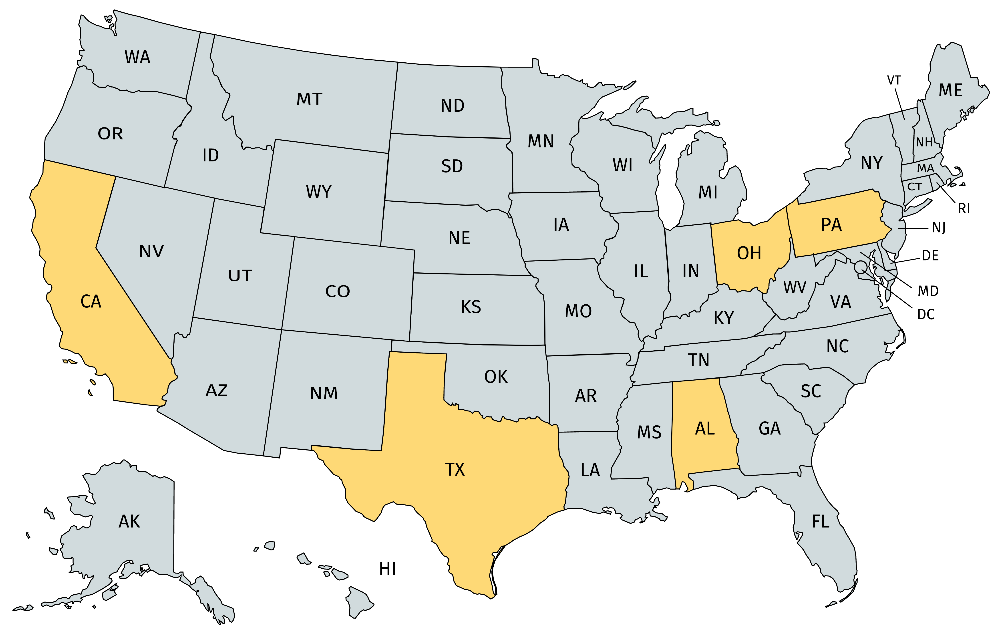

# State Responses: Selected Case Studies

_Student Lead:_ ****Katie Shaffer

_Student Authors:_ Andrew Foley, MPH; Sarah Onorato; Simone Sasse; Katie Shaffer

_**Please Note:** While our curriculum is reviewed by expert faculty, this section focuses on specific state responses with which faculty in Boston may not be familiar. As such, faculty review may not apply to this entire section._

The United States has been unique in its response to COVID-19 – despite now having the [highest number of cases](https://www.sciencemag.org/news/2020/04/united-states-leads-coronavirus-cases-not-pandemic-response#) in the world, its national government has largely delegated the response to local and state entities. This reflects the nation's long history of both a decentralized healthcare system and public health infrastructure. The resultant [patchwork](https://www.nytimes.com/2020/03/15/us/united-states-coronavirus-response.html) of approaches by states, cities, and counties across the country has become apparent in the past weeks. Preparedness plans, and the information used to create them, vary widely by state and region. Experts warn that these [disparities in preparation](https://khn.org/news/during-a-pandemic-states-patchwork-of-crisis-plans-could-mean-uneven-care/) may lead to disparities in outcomes. Others caution that small-scale mobilization is [not sufficient](https://www.nejm.org/doi/full/10.1056/NEJMp2006740) to meet the demands of coronavirus and could result in significant long-term health, economic, and social consequences. With states at the leading edge of the COVID-19 response, it is important for medical students and other health profession trainees to have the skills to critically examine state and local public health responses. 

While we are not able to cover every state, we’ve highlighted a few [here](https://docs.google.com/document/d/17dUmXrdfCQtDYfNH4aQfX4pdY9mEpOqqBFeB1KLcC5M/edit#heading=h.2vhfgg8qbbc3) that are distinct in their approaches: California’s population is the largest in the country, and leaders have had to consider a diverse population across a large geographic span; Ohio acted early to implement strong social distancing measures, despite initially having fewer cases than states of comparable size and population; Texas has relied primarily on action from local and county officials, with state-wide measures only coming later; Pennsylvania acted early but gradually, initially imposing restrictions on a county-by-county basis before enacting statewide measures. Alabama serves as an example of a response in a state with more rural populations and a historically politically conservative government; responses were initially led by county leaders, but are now being coordinated statewide by the governor. We plan to profile additional states in the coming weeks.

## Helpful Resources in Understanding State Responses

* Kaiser Family Foundation: [State Data and Policy Actions to Address Coronavirus](https://www.kff.org/health-costs/issue-brief/state-data-and-policy-actions-to-address-coronavirus/)
* National Conference of State Legislatures: [State Action on Coronavirus](https://www.ncsl.org/research/health/state-action-on-coronavirus-covid-19.aspx)
* Institute for Health Metrics and Evaluation: [COVID-19 Projections](https://covid19.healthdata.org/united-states-of-america)
* Johns Hopkins University Website - County Level Data on Health Infrastructure and COVID-19 Cases: [https://coronavirus.jhu.edu/us-map](https://coronavirus.jhu.edu/us-map)

## **Thought Questions for Understanding Your Own State’s Response**

While we have highlighted states [here](https://docs.google.com/document/d/17dUmXrdfCQtDYfNH4aQfX4pdY9mEpOqqBFeB1KLcC5M/edit) that have taken a unique approach to managing the pandemic, or who have been particularly hard-hit, each state \(and city and town!\) has its own approach. We encourage you to think critically about these responses, and to use some of the themes discussed in this section to inform your evaluation of local and state public health responses around the country.

* Who lives and works in the state, and how do their lives impact how the virus spreads?
* Who has been orchestrating the response within the state? How does their background and expertise affect their leadership?
* What does public health look like at baseline? How has the safety net \(or lack thereof\) affected the trajectory of the virus?
* How did the state fare in the 1918 Influenza epidemic? Check out [this site](https://www.influenzaarchive.org/index.html) from the University of Michigan Center for the History of Medicine for more information.
* How has the state handled testing? Who has access and why?
* What kinds of social distancing and non-pharmacologic measures were put in place, and when? How do these measures and timing impact the spread of the virus?
* How have leaders communicated important information to the public?

## Selected Case Studies

To view the cases, click [HERE](https://docs.google.com/document/d/17dUmXrdfCQtDYfNH4aQfX4pdY9mEpOqqBFeB1KLcC5M/edit?usp=sharing).

