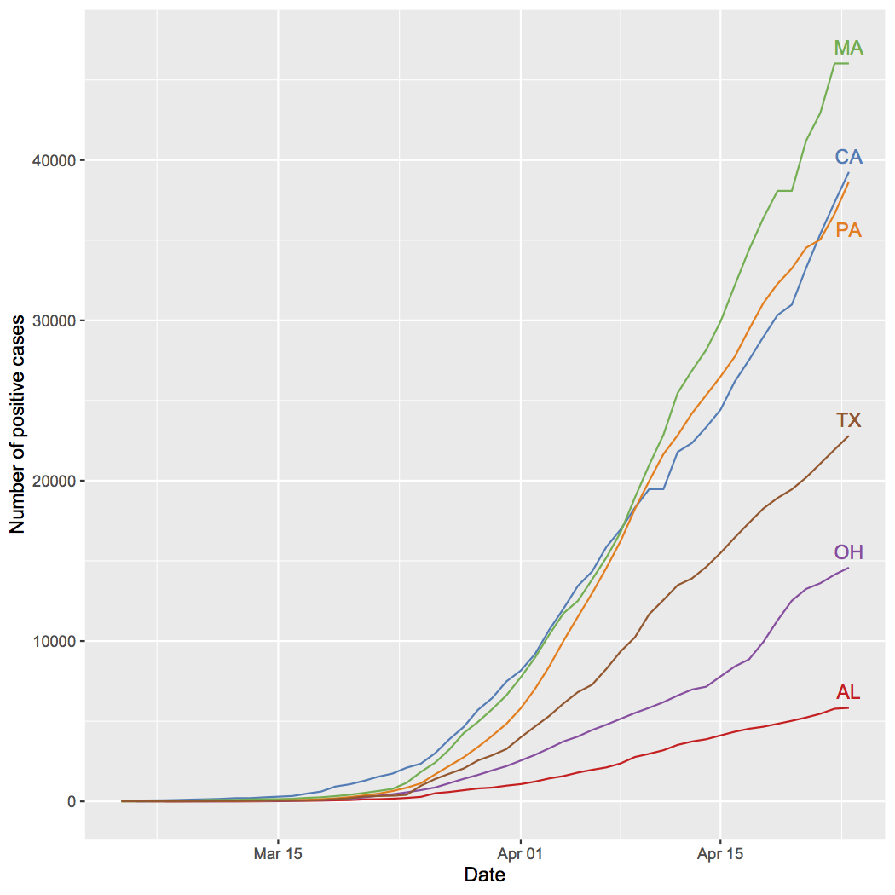

# State Responses to COVID-19: Selected Case Studies

Case Study Student Authors: Andrew Foley MPH, Michael Fuchs, Mugdha Mokashi, Sarah Onorato, Hema Pingali, Simone Sasse, Katie Shaffer

_**Please Note:** While our curriculum is reviewed by expert faculty, this section focuses on specific state responses with which faculty in Boston may not be familiar. As such, faculty review may not apply to this entire section._

The U.S. has been unique in its response to COVID-19. Despite now having the [highest number of cases](https://www.sciencemag.org/news/2020/04/united-states-leads-coronavirus-cases-not-pandemic-response#) in the world, relatively little action has taken place at the level of the national government. The U.S. has historically utilized a decentralized approach to public health, and the resulting [patchwork](https://www.nytimes.com/2020/03/15/us/united-states-coronavirus-response.html) of approaches by states, cities, and counties has become apparent in the past weeks. Preparedness plans, and the information used to create them, vary widely by state and region, and experts warn that these [disparities in preparation](https://khn.org/news/during-a-pandemic-states-patchwork-of-crisis-plans-could-mean-uneven-care/) may lead to disparities in outcomes. Others caution that small-scale mobilization is [insufficient](https://www.nejm.org/doi/full/10.1056/NEJMp2006740) to overcome the demands of COVID-19. With states at the leading edge of the COVID-19 response, it is important for medical students and other health profession trainees to have the skills to critically examine state and local public health responses.

While we are not able to cover every state, we’ve highlighted a few that are distinct in their approaches. California’s population is the largest in the country, and leaders have had to consider a diverse population across a large geographic span. Ohio acted early on many social distancing measures, despite relatively few cases early on. Texas has relied on actions from local and county officials, with state action coming later. Pennsylvania has taken a county-by-county approach, rather than enacting statewide measures. Alabama serves as an example of a response in a state with more rural populations and a historically politically conservative government; responses were initially led by county, but are now being coordinated statewide by the governor. Massachusetts is a densely populated state with a large healthcare infrastructure. We plan to profile additional states in the coming weeks.

_Graphics by Jennifer Ge, HMS Student; data from_ [_The COVID Tracking Project_](https://covidtracking.com/)\_\_

## Helpful Resources in Understanding State Responses:

* Kaiser Family Foundation: [State Data and Policy Actions to Address Coronavirus](https://www.kff.org/health-costs/issue-brief/state-data-and-policy-actions-to-address-coronavirus/)
* National Conference of State Legislatures: [State Action on Coronavirus](https://www.ncsl.org/research/health/state-action-on-coronavirus-covid-19.aspx)
* Institute for Health Metrics and Evaluation: [COVID-19 Projections](https://covid19.healthdata.org/united-states-of-america)

## Thought Questions for Understanding Your Own State’s Response

While we have highlighted states that have taken a unique approach to managing the pandemic or have been particularly hard-hit, each state \(and city and town!\) has its own approach. We encourage you to think critically about these responses and use some of the themes discussed in this section to inform your evaluation of local and state public health responses around the country.

* Who lives and works in the state, and how do their lives impact how the virus spreads?
* Who has been orchestrating the response within the state? How does their background and expertise affect their leadership?
* What does public health look like at baseline? How has the safety net \(or lack thereof\) affected the trajectory of the virus?
* How did the state fare during the 1918 Influenza epidemic? Check out [this site](https://www.influenzaarchive.org/index.html) from the University of Michigan Center for the History of Medicine for more information.
* How has the state handled testing? Who has access and why?
* What kinds of social distancing and non-pharmacologic measures were put in place and when? How do these measures and timing impact the spread of the virus?
* How have leaders communicated important information to the public?

## Selected Case Studies

To view the cases, click [HERE](https://docs.google.com/document/d/17dUmXrdfCQtDYfNH4aQfX4pdY9mEpOqqBFeB1KLcC5M/edit?usp=sharing).

