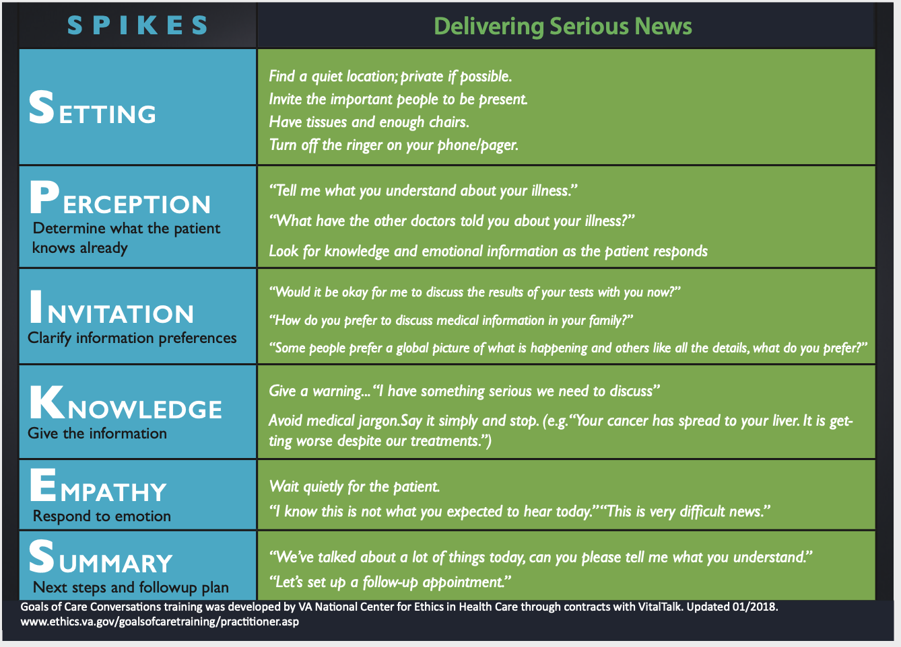
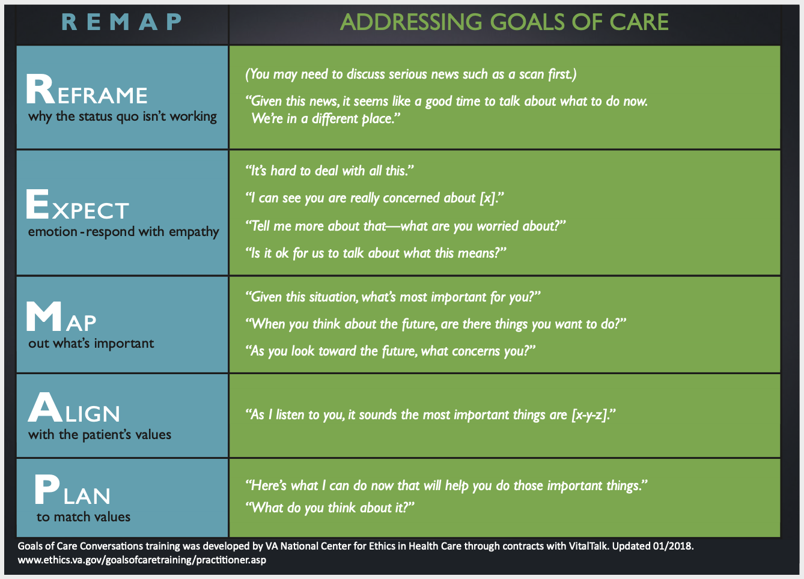
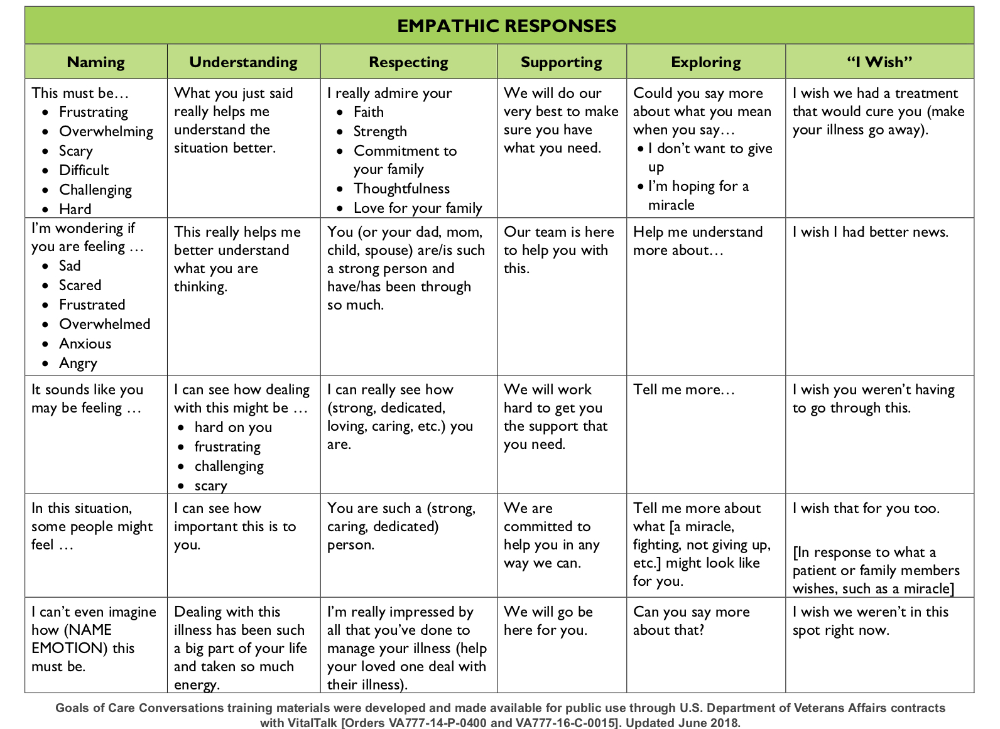

# Skillset Review

Let’s review some _critical communication skills_ in the context of a public health emergency. First, recall the overarching principles for physician/medical student communication with patients: build a relationship, open the discussion, gather information, understand the person’s perspective, share information, reach agreement on problems and plans, and provide closure \([Makoul, Acad Med 2001](https://www.ncbi.nlm.nih.gov/pubmed/11299158)\). Depending on the scenario in which you find yourself \(talking with an individual or in a group setting\), you may also find the [CDC Crisis + Emergency Risk Communication](https://www.cdc.gov/coronavirus/2019-ncov/downloads/fs-CERC-Infectious-Disease.pdf) \(CERC\) in an Infectious Disease Outbreak principles helpful as well:

1. Build trust and credibility by expressing empathy and caring, competence and expertise, honesty and openness, commitment and dedication
2. Acknowledge uncertainty, validate concern, and explain the process in place to find answers
3. Be prepared to answer questions about safety and expectations moving forward. 

With these principles in mind, let’s take a deeper dive into communication frameworks for **having difficult conversations** and **giving bad news** in the context of the coronavirus pandemic.

## **Difficult Conversations**

A useful paradigm to keep in mind during these sorts of interactions is set forth by Harvard Law School Professors Douglas Stone, Bruce Patton, and Sheila Heen in their New York Times-bestselling book “Difficult Conversations.” \(If you haven’t read it before, now is as good a time as any! If nothing else, read the Introduction and Chapter 1 to get an idea of the framework.\)

In studying a variety of conversations, they found: 

> > _**An underlying structure to what’s going on, and understanding this structure, in itself, is a powerful first step in improving how we deal with these conversations. It turns out that no matter what the subject, our thoughts and feelings fall into the same three categories, or ‘conversations.’ And in each of these conversations we make predictable errors that distort our thoughts and feelings, and get us into trouble.**_

The three conversations can be summarized as:

**1. The Facts Conversation.** In discussions about COVID-19, this would encapsulate things like R0 or the anticipated impact of physical distancing on flattening the infection curve. This knowledge is critical for us as physicians. Given our own biases as physicians-in-training \(perhaps including, among other things, our personality types, coping styles, and all the effort we’ve invested into amassing our medical knowledge\), our go-to approach to uncertain or challenging situations is often to return to the facts. However, no matter how convincing the evidence may be, or how effective we are as communicators and teachers, facts alone are not enough to reliably fuel real change.

Psychologist Jonathan Haidt describes this idea in his metaphor of the [Elephant and the Rider](https://www.creativehuddle.co.uk/the-elephant-and-the-rider). Although it may seem like the Rider, representing logic and reason, can control where the two end up, the Rider’s commands are worthless unless they’re directing the Elephant’s own efforts. If they are in opposition, the Elephant always wins out. How can we tap into the Elephant?

**2. The Feelings Conversation.** More often than not, emotions are at the heart of difficult conversations and should not be framed out of the problem: If our partners’ feelings are negative or different from ours, we should not view them as barriers or as issues to resolve. Making space for and acknowledging emotions is [critical to building a relationship](https://eprognosis.ucsf.edu/communication/video-emotions.php) that allows more meaningful connections.

The first step is to recognize those emotions; we can make that easier by anticipating them ahead of time. The exact emotions evoked in a given situation depend on how that situation relates to the values we hold most dear. Sometimes what sounds like a factual question is actually an expression of emotion. For example, “How can this be happening?” may not necessarily be a question about coronavirus epidemiology, but rather an expression of worry or fear.

**3. The Identity Conversation.** At the core of every difficult conversation is what this situation means to us. The authors explain: “We conduct an internal debate over whether this means we are competent or incompetent, a good person or bad, worthy of love or unlovable. What impact might it have on our self-image and self-esteem, our future and our well-being?”

And all this cuts both ways: the conversation involves both your identity as well as your partner’s. What does the outcome of the conversation mean to you? Taking stock of this ahead of time will prevent you from getting caught up and acting against your best judgment.

In short, focusing on facts without feelings will only make the conversation worse. To best anticipate your partner’s feelings, it helps to think about their identity and how the situation may relate to their most important values. The subsequent sections review specific communication techniques that have been proven to help clinicians provide facts about challenging situations in a way that also addresses the underlying emotions.

_Thought Question:_ 

* Look at some of the dialogues in the resource, [COVID ready communication](https://docs.google.com/document/d/1uSh0FeYdkGgHsZqem552iC0KmXIgaGKohl7SoeY2UXQ/mobilebasic). How do the three conversations surface?

It is equally important that you take stock of your own reactions in preparing for potentially difficult encounters with patients. Anticipating your own negative feelings–especially in light of how stressed you are or how many demands are being placed on you–may help you recognize these emotions and let them go in the interest of a more productive interaction. For example, you may find that the anxiety of patients who are not sick or the demands of patients who are mildly ill evoke in you feelings of annoyance, and even anger, when you are simultaneously seeing severely ill patients. These are perfectly normal reactions, but they will not lead to productive encounters. The important thing is to accept your feelings and try to let them go as you turn your attention to each particular patient.

## **Giving Bad News**

Many conversations around the coronavirus pandemic will involve delivering difficult or serious news. Here, we can apply several frameworks that we have learned in the clinical setting to the conversations we have with patients, as well as in the community with a non-clinical audience.

### SPIKES

SPIKES is a [mnemonic developed](https://theoncologist.onlinelibrary.wiley.com/doi/full/10.1634/theoncologist.5-4-302) by oncologists for delivering bad or serious news. This approach to giving bad news is relevant in a pandemic, given the range of evoked emotions, including denial, fear, and altruism. Please review SPIKES below.

### REMAP

REMAP is a [mnemonic developed](https://www.ncbi.nlm.nih.gov/pubmed/28445100) to guide Goals of Care discussions. As medical students, we may be asked to care for patients with COVID-19 or to talk with family members of affected patients. Such encounters may involve Goals of Care discussions where REMAP would be most applicable. REMAP can also be used outside of clinical settings to guide challenging conversations when expectations between two parties do not align. Can you envision a scenario where you could apply the REMAP framework?

### NURSE/Expressing Empathy

Regardless of the framework used, giving bad news is challenging for both the person delivering the news and the person receiving such news. Sometimes, a person receiving the news may react with anger, frustration, heightened anxiety, sadness, or another similarly intense emotion. Having a framework for your response in this moment can be helpful for demonstrating how much you care. The NURSE framework is one guide. A review of this concept is provided below with relevant examples; both “I wish” and “I wonder” statements can be helpful. Brainstorm 1-2 scenarios where you would use the NURSE framework in the context of COVID-19.

_Thought questions:_ 

* How might you apply these frameworks differently when talking to [**Diane**](https://curriculum.covidstudentresponse.org/curriculum-overview/cases#case-2-diane) and [**Brian**](https://curriculum.covidstudentresponse.org/curriculum-overview/cases#case-1-brian)?
* [This activity](https://www.nytimes.com/interactive/2019/11/26/opinion/family-holiday-talk-impeachment.html) from the NYT is an opportunity to play out a conversation with someone who holds different political views. Unrelated as it may seem, there is a reason why we recommend it. How might our frameworks compliment their approaches to conflict resolution?

