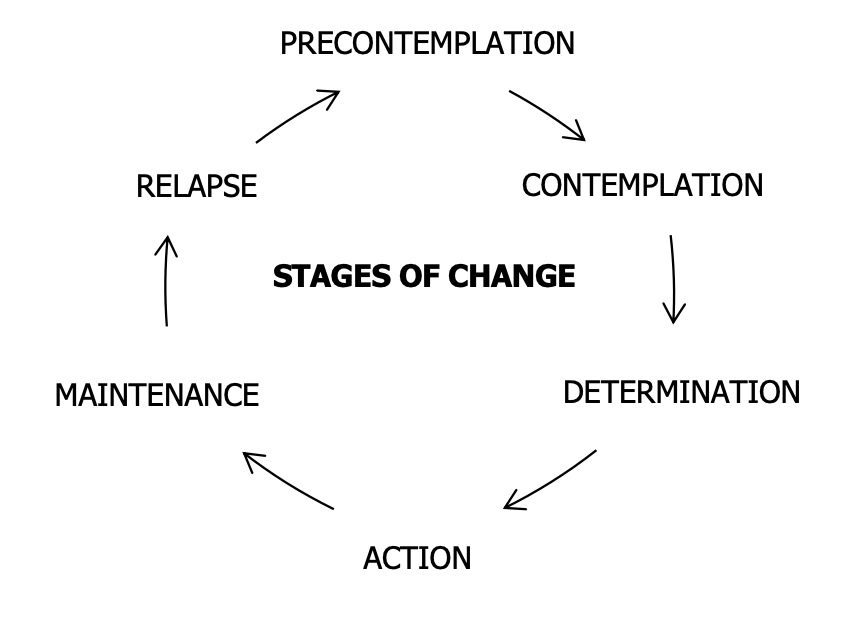
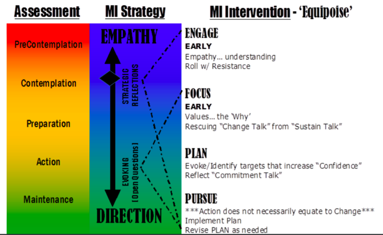
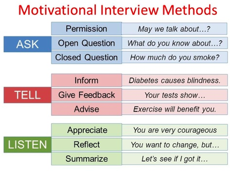

# Sustaining Constructive Behaviors Over Time

As you have learned in previous modules, public health measures like physical distancing are necessary to reduce disease transmission. Because the efficacy of these measures depends on high rates of compliance in the general population, COVID-19 can be seen as a behavior-related illness. We must equip ourselves with the tools to best ensure adherence to recommended practices.

**Prochaska’s Stages of Change Model**

This is an appropriate time to review the six stages of change \([Levinson et al., Ann Intern Med 2001](https://annals.org/aim/article-abstract/714741/change-change-sounds-like-you-have-dilemma)\). The most effective approach to addressing a change in behavior should take into account the person’s willingness to change, motivating factors towards change, and barriers standing in the way. This framework is helpful as a roadmap for the process of behavior change, and it aids in engaging individuals in the process of change.

_Thought Question_: 

* With this framework in mind, how would you start a conversation with [**Brian**](https://curriculum.covidstudentresponse.org/curriculum-overview/cases#case-1-brian) about physical distancing? How would you start a conversation with [**Diane**](https://curriculum.covidstudentresponse.org/curriculum-overview/cases#case-2-diane) about physical distancing?

## Motivational Interviewing

This section will provide a refresher course on the principles of motivational interviewing. When engaging people in conversations about behavior changes, the four processes central to the approach are as follows:

1.  **Engaging** the person in a high-quality, supportive relationship by:

* Expressing appreciation of the person’s main concern, even if they disagree with you. Acknowledge their efforts to change and willingness to engage in discussion.
* Building affiliation by partnering with the person. Collaborate on defining goals and agreeing on strategies, try to face the problem from shared goals \(e.g. reducing spread of disease to loved ones who are at high risk of severe illness\)
* Minimizing status differentials. Acknowledge that this person is the expert on their life. Convey information in a straightforward fashion and listen actively.
* Choosing a role that you feel is appropriate for the situation: cheerleader, coach, teacher, monitor, disciplinarian, friend, confessor, etc.
* Emphasizing autonomy, above all. People are much more likely to change if they feel they have the power to choose whether and how to proceed. Emphasize that any next steps are completely up to them. Affirm their strengths and self-efficacy. Point them towards helpful resources that they can consult on their own time. 

2. **Focusing** on one specific behavior can help improve the chances of successfully changing it. This is where the “Ask-Tell-Ask” framework comes into play–when one informs people about risks and benefits of various behaviors \(see figure below\). Help them identify what matters most to them and which behaviors they want to change.

3. **Planning** and evoking “change talk” in which patients express their **D**esires, **A**bilities, **R**easons, **N**eeds, and **C**ommitment to change \(DARN-C\). This can be done by:

* Summarizing/Reflecting as a part of active listening. You don’t have to use the person’s exact words, but the purpose is to show the patient you are listening.
* “On a Scale from 1 to 10, how likely are you to change X?” Then ask, “Why not a lower number?” This will get them to express motivations for change.
* Ask-tell-ask can also play a role here. Ask the person what they understand about the risks of their behavior. Tell the patient how that relates to what you know. Then ask how this new information might apply to their situation. 

4. Pursuing and executing next steps that are **S**pecific, **M**easurable, **A**chievable, **R**elevant, and **T**ime-bound \(**SMART**\). Remember, this person has the autonomy to execute the plan. All your efforts to this point to reinforce that should enable them to feel motivated to execute it!

