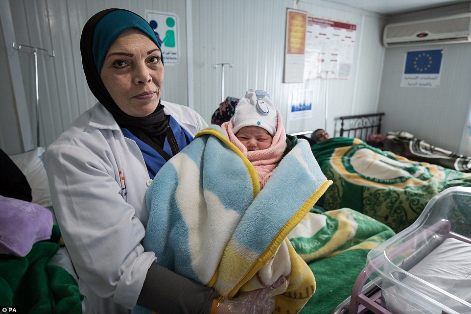

# Refugee and Migrant Health Case Study

The case of [refugee health in the context of COVID-19](https://www.thelancet.com/journals/lancet/article/PIIS0140-6736%2820%2930791-1/fulltext) is a global question that is yet to be fully addressed. The unique needs of this population and the innovative solutions being piloted illustrate the 4 S’s model being used for the rest of the sections. **Staff** includes issues getting medical professionals to care for patients in refugee camps and efforts to utilize the refugee workforce to help out in the pandemic. **Stuff** includes providing basic resources such as soap, water, and basic medical equipment to refugee camps and settlements in LMICs. **Space** is a key issue in refugee camps, where thousands are cramped in close proximity without the ability to socially distance and often without space for medical facilities, and for the refugees and migrants in HIC who are marginally housed or homeless. **Systems** are what need to be put into place to address many of these issues, including de-densifying camps, improving access to medical care, food, water, and hygiene supplies, and creating government-level contingency plans that take refugee health into account.

## _Housing and Resources_

Populations without access to [stable, safe housing](https://en.wikipedia.org/wiki/Refugee_camp) are at increased risk of COVID-19, and special attention must be paid to supporting these populations. There are 70 million refugees and displaced people around the world according to the [UN Refugee Agency](https://www.unhcr.org/en-us/news/stories/2019/6/5d08b6614/global-forced-displacement-tops-70-million.html), and the vast majority of them live in LMICs. The refugees and migrants who are living in informal \(e.g. tents, abandoned buildings\) or formal settlements \(e.g. refugee camps\) are particularly susceptible to COVID-19 given their inability to access essential resources like [food](https://www.nytimes.com/2020/03/26/world/asia/coronavirus-refugees-camps-bangladesh.html), [soap, and water](https://www.npr.org/sections/goatsandsoda/2020/03/11/814473308/opinion-refugees-are-especially-vulnerable-to-covid-19-dont-ignore-their-needs); obtain medical care; and practice [social distancing](https://blogs.msf.org/bloggers/blogs-team/five-eye-opening-blogs-doctors-without-borders-march-2020). While there are not currently any reports of widespread transmission within refugee camps, experts are greatly concerned about the devastating toll it would take upon this uniquely vulnerable population if containment efforts are unsuccessful. “It would be a disaster. It would be more devastating than the insurgency \[by Boko Haram\] that brought them here,” said [Ahmadu Yusuf](https://www.nytimes.com/2020/03/26/world/asia/coronavirus-refugees-camps-bangladesh.html), a community leader in the Bakassi refugee camp in Nigeria. Few governments have put special attention towards the health needs of refugees and migrants that live within their country, despite the unique needs of this population.

## _Medical Care in Refugee Camps_

Refugee camps perpetually face challenges in providing even [basic medical care](https://www.dailymail.co.uk/news/article-3367674/Born-refugee-Syrian-babies-welcomed-world-80-000-strong-camp-one-Jordan-s-largest-cities.html) given lack of medical personnel and health facilities. While no positive cases have yet been discovered at refugee camps, this is likely due to [lack of testing](https://www.nytimes.com/2020/03/19/world/middleeast/syria-coronavirus-idlib-tents.html). Some camps are preparing for what seems to be an inevitable arrival of COVID-19, such as the Dadaab refugee camp in Kenya that has [90 beds within the refugee camp](https://www.aljazeera.com/news/2020/03/front-worry-covid-19-spreading-african-refugee-camps-200329054029304.html) set up for COVID-19 isolation, as well as a partnership with the local community isolation facilities.

However, while many camps do not currently have the infrastructure, examples show it is possible to set up robust medical care in refugee camps. One promising model, led by Médecins Sans Frontières \(MSF or Doctors Without Borders\), established a [primary care clinic](https://www.ncbi.nlm.nih.gov/pubmed/30976298) in the Shatila refugee camp in Beirut, Lebanon in 2013 with four main components: case management, patient support and education counseling \(PSEC\), integrated mental health, and health promotion. Using their integrated team of doctors, nurses, and other medical personnel, they were able to almost double the number of patients with diabetes and hypertension who were at goal for hemoglobin A1C levels or blood pressure within 6 months of care. Utilizing team-based care with a patient-centered approach to identify, closely follow up with, and support patients could be a transferable model to help with the pandemic.

## _Dissemination of Accurate, Timely Information_

Information dissemination is particularly challenging for refugee populations that do not speak the majority language of the country they are in and do not have access to news or internet. In Bangladesh, limited internet access for the Rohingya has caused [false information to circulate](https://www.nytimes.com/2020/03/26/world/asia/coronavirus-refugees-camps-bangladesh.html) and panic to spread. Programs such as the UN refugee agency, the UNHCR, have been running massive awareness campaigns using text messages, sending [15,000 informational texts](https://reliefweb.int/report/world/unhcr-staying-and-delivering-refugees-amid-covid-19-crisis) about the disease and its prevention to urban refugees living in Khartoum, Sudan. Other solutions include setting up [language lines](https://www.nrc.no/news/2020/march/10-things-you-should-know-about-coronavirus-and-refugees/) with accurate and relevant information on a countrywide level in the language of the refugee population.

## _Care for Refugees in High Income Countries_

Refugees in high income countries \(HICs\) also face [substantial barriers to accessing care](https://www.ncbi.nlm.nih.gov/pmc/articles/PMC5603273/). When a refugee arrives in a new country, efforts to connect them into stable care pathways in the health system are lacking. Many countries have [legal restrictions](https://www.ncbi.nlm.nih.gov/pubmed/16230318/) on access to care for asylum seekers, limiting them only to emergency care. They also face significant financial barriers if the country does not guarantee them free health care. Additionally, they often receive culturally insensitive care or inadequate interpreter services.

However, some countries are proactive and inclusive in their health care system, such as [France](https://www.who.int/migrants/publications/EURO-report.pdf), which gives its universal free health insurance to low-income irregular migrants and people seeking asylum. Orientation is offered in 23 languages. Another innovative program is the [Together Against Tuberculosis project in Germany](https://www.who.int/migrants/publications/EURO-report.pdf) that pairs medical students with patients with tuberculosis to provide support through the directly observed therapy strategy.

As refugees are generally viewed only as consumers of healthcare services, their ability to contribute to the health system is often undervalued or rarely recognized. Many refugees were working as physicians or other health care professionals previously, but due to extensive regulatory barriers and costs, are unable to work in the new setting/country where they live as a refugee. They are particularly well equipped to help given their experience working in high-pressure, low-resource settings. For example, during the [ebola epidemic](https://www.unhcr.org/en-us/news/latest/2016/6/5750093e4/ebola-hit-liberia-refugees-took-frontline-health-role.html), refugee medics were key in providing care in the frontlines and limiting the spread of the epidemic. In the current COVID-19 crisis, [Germany](https://uk.reuters.com/article/uk-health-coronavirus-germany-refugees/refugees-to-the-rescue-germany-taps-migrant-medics-to-battle-virus-idUKKBN21C2I%20https://www.infomigrants.net/en/post/23690/germany-migrants-and-refugees-may-fill-labor-gaps) and the [UK](https://www.theguardian.com/world/2020/mar/25/covid-19-call-for-fast-track-registration-of-refugee-doctors-in-uk) are in the process of fast-tracking applications from refugee medics, many of whom are physicians, and have each received hundreds of applications. A group of [Syrian refugees in Switzerland](https://www.unhcr.org/en-us/news/stories/2020/3/5e7878d94.html) set up a network of young, healthy volunteers to assist the elderly with grocery shopping and other necessary errands, while maintaining social distancing and proper hygiene practices. One of the volunteers said that her experience as a refugee makes her better equipped to respond to the pandemic: “We lived, and we are still living, a crisis as refugees. That makes us probably in a better position to understand that there is a crisis and how to help.” So far, the volunteer network has shopped for 200 elderly people in need.

## _Policy Implications and Takeaways_

As the world grapples with COVID-19, the [refugee population](https://medium.com/@UNmigration/iom-new-diphtheria-wards-saving-lives-and-calming-fears-of-rohingya-refugees-b796902704a6) - which is historically marginalized and stigmatized - is both extremely vulnerable to the consequences of this health threat while also failing to capture the attention of policy makers. It is essential for governments to work with health authorities and experts on refugee health to include refugees in national preparedness plans to contain the spread of the virus while providing adequate protections for this vulnerable population.

Lessons from refugee health will also be relevant for dealing with people who are homeless or marginally housed in the midst of this crisis. They are among our world’s most vulnerable people and are being left behind in the epidemic, which endangers their health and the health of the public at large. Particularly in the U.S., this is relevant to three vulnerable populations: asylum seekers at the U.S. border, people who are homeless, and people who are incarcerated. The U.S. has closed its border to asylum seekers and continues the forced return of people seeking safety to Mexico, endangering their health and the health of the populations with whom they interact. It is imperative that the U.S. makes a [comprehensive plan](https://www.msf.org/us-must-include-asylum-seekers-covid-19-response) on how to deal with migrants and asylum seekers in the pandemic, with the health and dignity of these people being a top priority. The U.S. also needs to make a plan on how to assist people who are homeless. While the CDC has issued [guidelines](https://www.cdc.gov/coronavirus/2019-ncov/need-extra-precautions/unsheltered-homelessness.html?CDC_AA_refVal=https%3A%2F%2Fwww.cdc.gov%2Fcoronavirus%2F2019-ncov%2Fcommunity%2Fhomeless-shelters%2Funsheltered-homelessness.html) specifically for homeless populations, these are difficult to implement. There are many innovative approaches being suggested, such as relocating homeless people to [empty dorm housing](https://www.statnews.com/2020/03/31/a-radical-approach-to-preventing-covid-19-infection-in-the-homeless/). In terms of individuals who are incarcerated, many states have begun efforts to [minimize their jail and prison populations](https://www.prisonpolicy.org/virus/virusresponse.html) to prevent the spread of the virus, however there has not been widespread policy on how to support these people after release. Taken together, this case study underscores the utmost importance that policymakers develop and implement smart policies on housing, food security, employment, and access to health care for our world’s most vulnerable populations in the face of COVID-19. Though ignoring the most vulnerable is never just, these injustices are unveiled in the face of a pandemic that shows how interconnected we are.

_Thought questions_: _Staff_

* How can we increase the medical workforce in refugee camps during a pandemic? What role could task shifting play in meeting healthcare demands in refugee camps? How could members of the community directly contribute to the care of patients?
* What would be the opportunities and challenges in introducing refugee or otherwise internationally-trained doctors into the American health care system for the first time during a pandemic?

_Thought questions_: _Stuff_

* How can a food and water supply to refugee camps be guaranteed with the impending challenges to the global supply chain?
* Is deploying proper personal protective equipment to refugee camps feasible? How should it be prioritized against other competing needs? How can materials that are available within refugee camps or the local community be used to make PPE?

_Thought questions_: _Space_

* If you could redesign refugee camps, given limited resources and space, how would you create them?
* What housing resources can be mobilized in high income countries to improve the health of people who are homeless?
* How can treatment facilities be created to meet the needs of the population at the US-Mexico border?

_Thought questions: Systems_

* If you are in the ministry of health for a low, middle, or high income country, what recommendations would you make to the government about effective ways to address refugee health in pandemic contingency planning?

We welcome your feedback on this module and on the curriculum overall. Please share it [here](https://docs.google.com/forms/d/e/1FAIpQLSc011UD-NF1WCvFHb7qWfluu4G9nxb6P4c9l3c8S3ZqxXxNOg/viewform).

