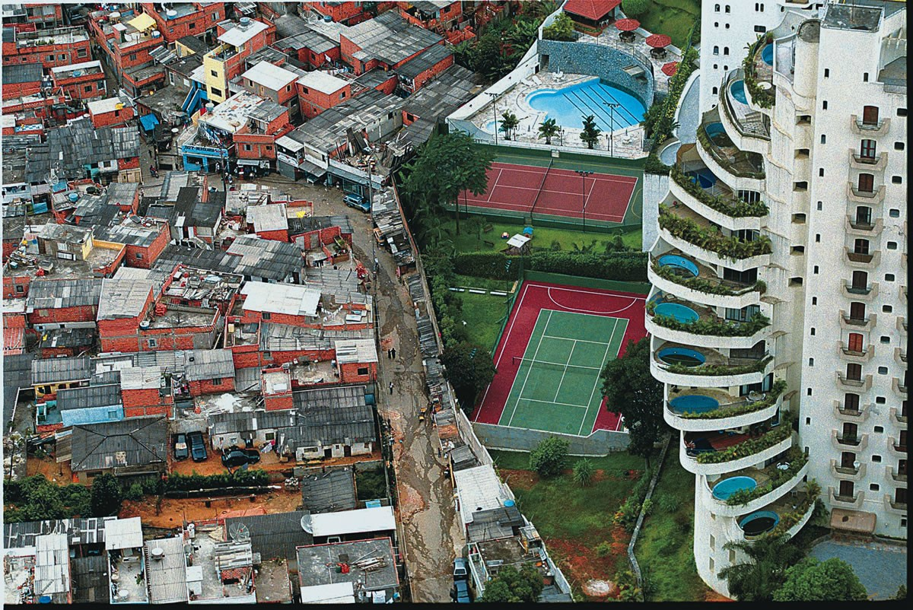
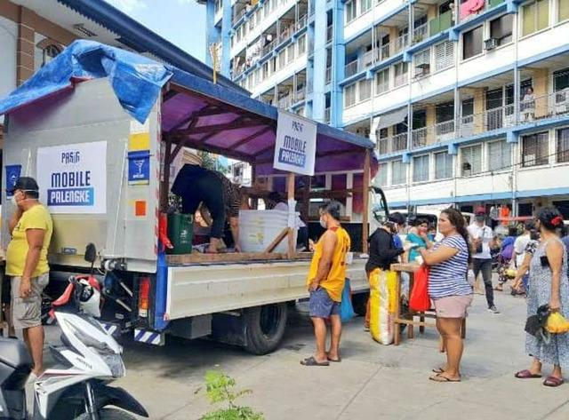
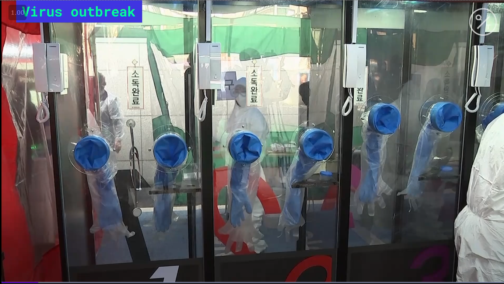
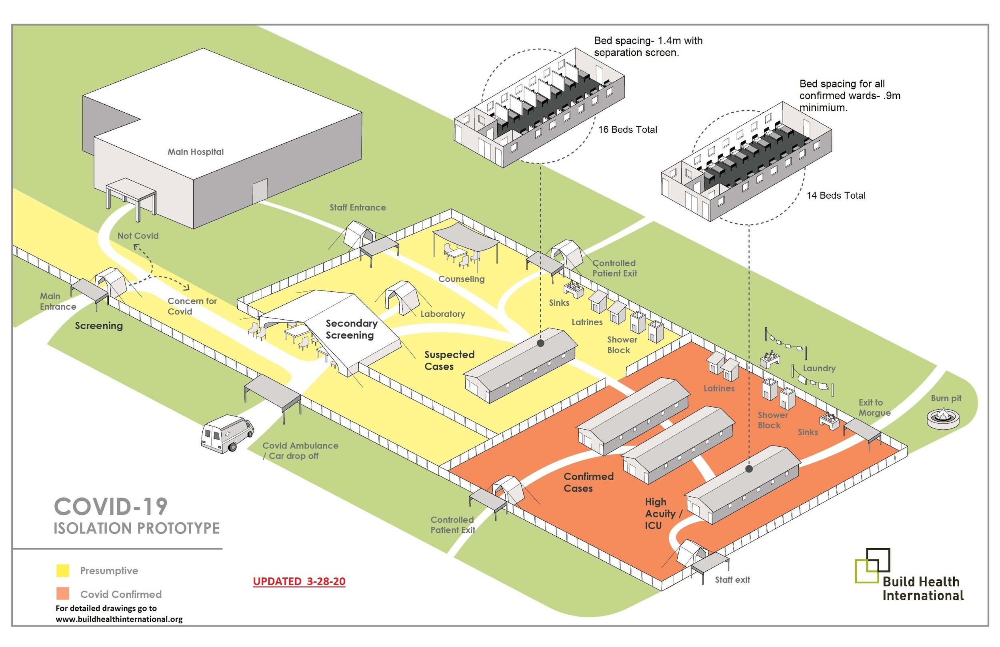

# Space

In this section, we focus on the third component of the 4 S framework: “space”. This component relates to the presence or absence of physical structures or constraints that can affect health outcomes. Space presents a double challenge in COVID-19. First, spaces that facilitate social distancing or shelter-in-place are needed, a challenging prospect in some densely populated, lower-income communities. Second, for positive or suspected cases of COVID-19, there must be a dedicated safe facility for diagnosis, treatment, and isolation. These facilities will prevent further community spread and keep providers safe from acquiring or transmitting the infection.

## Challenges Following Public Health Recommendations in LMIC Communities

As discussed in [Module 2](https://curriculum.covidstudentresponse.org/module-2-epidemiology-principles) and [Module 3](https://curriculum.covidstudentresponse.org/module-3-current-situation-and-healthcare-response), the most widely-used interventions to reduce the spread of COVID-19 are social distancing among asymptomatic individuals and quarantine for those with confirmed or suspected infection. Implementing these interventions is particularly challenging in countries where the economy and governmental social supports are less robust. Due to a long history of colonialism and chronic lack of investments in poor communities, many remain economically vulnerable. This concept can be described as [structural violence](https://pdfs.semanticscholar.org/048d/d6fa65e90f610d24ba604f2c97f752d9f5c2.pdf), a systemic form of indirect oppression which creates poverty and steep grades of persistent inequity that are very challenging to escape. The economic effects of social distancing or shelter-in-place directly [affect the income of economically vulnerable populations](https://www.undp.org/content/undp/en/home/news-centre/news/2020/COVID19_Crisis_in_developing_countries_threatens_devastate_economies.html) and decrease government budgets through decreased tax revenue.

Well-resourced individual in a given society may have larger homes or options to more easily self-isolate and thus prevent transmission even within the same household. In contrast, for those disproportionately living in crowded environments or impoverished areas, it may be more common to live in smaller dwellings with poor ventilation and many people, including extended family. These close living conditions in densely populated areas are a risk factor for respiratory diseases like COVID-19 which are [transmitted ](https://curriculum.covidstudentresponse.org/module-1-from-bench-to-bedside/basic-virology-and-immunology#transmission-dynamics)by respiratory droplets and contact with contaminated surfaces. In camps of asylum-seekers near the U.S.-Mexico border, residents in the tight living conditions have been encouraged to adopt [“head-to-toe” sleeping arrangements](https://www.dropbox.com/s/nviaa1sn752psqs/DurantPanel3.mp4?dl=0) to avoid transmission during sleep. In India, those living in crowded urban settlements [do not have anywhere to go](http://theconversation.com/indias-stark-inequalities-make-social-distancing-much-easier-for-some-than-others-134864) that would enable them to socially distance. In a [densely populated favela in Brazil](https://www.dw.com/pt-br/em-parais%C3%B3polis-moradores-ignoram-pandemia/a-53047778), Paraisopolis, with 45,000 people/km², 8 in 10 residents need to leave the favela to buy food or hygiene products and most share tight living spaces with many other people. As an additional complication, the WHO estimates that 40% of the global population [\(3 billion people\) do not have access to soap and water](https://www.who.int/water_sanitation_health/monitoring/coverage/en/) for hand-washing, a critical preventive measure against COVID-19.

For individuals living in poverty or those who have no financial buffer, quarantine adds to the [toll ](https://curriculum.covidstudentresponse.org/module-3-disparities-policy-socioeconomic-effects/socioeconomic-ramifications#impact-on-work-small-businesses-essential-workers-and-unemployment)that COVID-19 and other pandemics can take. With many workers in service industries, including street vendors or food workers, social distancing or quarantine makes it impossible to earn their living. In Paraisopolis, Brazil, 56% of residents [only have enough resources for food for one week](https://www.dw.com/pt-br/em-parais%C3%B3polis-moradores-ignoram-pandemia/a-53047778) without donations or returning to work. Basic living requirements like food, water, and rent can lead service workers to come to work despite public health recommendations and risk of infectious transmission. After learning of the government's proclamation that they will be forcing people to stay at home, one resident of Somaliland said, “Hunger can kill me first before COVID-19.” Residents in India are making similar decisions as well as attempting to [avoid police brutality](https://www.pbs.org/newshour/world/police-struggle-to-enforce-indias-sweeping-virus-lockdown). These examples illustrate the impossible decisions being weighed by those affected by the COVID-19 pandemic around the world.

In addition to these economic drivers, cultural and religious factors also influence the response to public health measures. For example, in countries with strong and widespread religious beliefs, there are often daily or weekly gatherings in [churches](https://www.npr.org/2020/03/13/815502396/churches-grapple-with-whether-to-suspend-worship-services), [mosques](https://www.theguardian.com/world/2020/mar/17/iranian-police-shrines-coronavirus), and prayer centers which are disturbed by these public health measures.

LMICs are at particularly high risk for severe social unrest during the COVID-19 pandemic as people struggle to fulfill their essential needs and then find themselves in conflict with local authorities that are enforcing lock-down measures. These conflicts have already arisen in some places including [Kenya](https://www.hrw.org/news/2020/03/31/kenya-police-abuses-could-undermine-coronavirus-fight#) and [South Africa](https://www.bbc.com/news/world-africa-52125713). Such unrest could undermine public trust and complicate future public health measures that may be required to combat COVID-19 in these settings and future outbreaks. In order to coordinate an effective response to COVID-19, addressing the challenges of living spaces and basic needs of citizens will be critical to enable individuals to follow public health recommendations.

_Thought Question:_ 

* What essential community locations would be highest risk for COVID-19 transmission and how could those be changed to support public health recommendations?

### Mobile food markets

To highlight how one country has aimed to respond to this emerging tension between essential needs and national quarantines, we turn to the example of decentralizing the traditional Palengke market model in the Philippines. Palengke is a Filipino term referring to a market that sells essential produce and other groceries at cheaper price points compared to supermarkets across the country. These markets are frequented mostly by low-to-middle-income households, regularly leading to crowding that undermines physical distancing measures.

The **mobile markets** initiative was created by a local government unit wherein multiple trucks make daily rounds around neighborhoods and cities to sell essential goods. With items such as fruits, vegetables, meat, and poultry available closer to homes, crowding is reduced. The [decentralization of the _palengke_ ](https://www.rappler.com/nation/255710-pasig-launches-mobile-palengke-coronavirus-lockdown-march-2020)ensures both social distancing and food security.

Other municipalities in the region have begun adopting unique versions of this initiative, helping citizens adapt to social distancing regulations. An example is [Valenzuela City](https://www.rappler.com/nation/256255-valenzuela-replicates-pasig-mobile-palengke) which, instead of trucks, made use of e-_tricycle_s \(motorbikes fabricated with passenger carts\) to cater to residents in regions of town not accessible to large vehicles. Local government efforts and other so-called “emergency trading centers” are now being recommended by industry groups that seek protection for farmers who need to sell their harvest.

## ‘Space’ Challenges in Diagnosis and Treatment

**Diagnostic testing facilities** are a critical part of the response to COVID-19. They must protect the healthcare professionals who are performing the testing, prevent transmission to uninfected people coming to be tested, and manage sufficiently high throughput to keep up with testing needs.

_Thought Question:_ 

* What types of testing facilities have you heard used in high income countries? What unique challenges might LMICs be likely to encounter?

### **Testing innovations**

**Drive-through testing centers** were made popular in [South Korea](https://www.cnn.com/2020/03/02/asia/coronavirus-drive-through-south-korea-hnk-intl/index.html) and are now being used across the [U.S.](https://time.com/5811061/drive-thru-coronavirus-testing-workers/) and Europe. There are many advantages to this approach. First, patients can use the air recirculation within the car, so even in close proximity there is minimal exposure for healthcare workers. Because patients stay in their cars, there are no possible interactions with others in parking lots or hallways where transmission could occur. The throughput is high, since no cleaning of surfaces or air space is needed between patients; new patients are evaluated every 2-5 minutes. However, a major disadvantage of drive-through testing is that it requires participants to have cars. In heavily-affected urban centers, many people rely on public transit. Lower-resourced communities in the U.S. or internationally are also less likely to have vehicle access. To serve the needs of these communities, an alternative testing strategy is required.

**Walk-in testing centers** were also developed in South Korea using an innovative [phone-booth method](https://www.youtube.com/watch?v=A-33i9B8m6E). The patient and provider are on opposite sides of a transparent barrier. Using reusable gloves, the provider swabs the patient’s oropharynx and nasopharynx, then the provider transports the sample to the lab nearby. These booths are much easier and faster to clean than a conventional room, with a turn-around time of only 10 minutes per patient. Similar methods are being considered in other HICs and may have a role to play in LMICs as well. For more detail on South Korea’s innovations, see [Module 2](https://curriculum.covidstudentresponse.org/module-2-epidemiology-principles/case-study-south-korea-2020).

### **Treatment center innovations**

Based on optimal infection prevention and control \(IPC\) measures, every patient exhibiting COVID-19 symptoms should be isolated in a single-occupancy, negative pressure room. However, this ideal has become unattainable as the pandemic has begun to overwhelm healthcare facilities worldwide. Cases requiring screening, hospitalization, and critical care are projected to far exceed existing capacity in LMICs and HICs alike. Low-income countries may be especially hard-hit, as they are estimated to have both significantly [fewer hospital beds and ICU beds per](https://www.preventionweb.net/publications/view/71077) [capita](https://www.preventionweb.net/publications/view/71077). Given these critical shortages in hospital space and beds, alternative strategies must be pursued to physically isolate, test, and treat patients with COVID-19. Several innovations are presented below for possible adaptation in a resource-limited setting.

[Build Health International](https://www.buildhealthinternational.org/) \(BHI\), a nonprofit developing sustainable health infrastructure in multiple LMICs, has generated [site plans, design drawings](https://www.buildhealthinternational.org/covid-infrastructure-resources/), and [blueprints](https://drive.google.com/file/d/1vZD3cSuUuOERhqlNn9koFPiuU1FgGuDo/view) for a COVID-19-focused screening and treatment center potentially deployable in many resource-limited communities. The center would be dedicated to triaging and treating patients with COVID-19 symptoms and would be built as either a standalone facility or an adjunct to current medical facilities \(Walton, [MGH Durant Technical Panel](https://bit.ly/durantsession2)\).

Many features of this center balance IPC and patient care with space and resource constraints. Patient wards would contain beds spaced 0.9-1.8 m \(3-6 ft\) apart, separated by partitions to limit cross-transmission. Windows installed above beds would provide natural ventilation and airflow–a practical alternative to negative-pressure wards. Oxygen would be delivered via O2 cylinders or by O2 concentrators if power is available. Overall, this center could enable large-scale cohorting, isolation, and treatment of patients with COVID-19. Located beyond the confines of existing clinics and hospitals, it would not only relieve overcrowding at those facilities but also minimize exposure of non-COVID-19 patients and healthcare personnel to the virus.

Similarly, in Metro Manila, the [most densely populated](https://psa.gov.ph/content/philippine-population-density-based-2015-census-population) region in the Philippines, community volunteers and local architects have mobilized to design and build [emergency quarantine facilities](https://bluprint.onemega.com/covid-19-emergency-quarantine-facility-filipino-architects/). These will house patients with presumptive COVID-19 who cannot be accommodated in area hospitals, several of which have already reached capacity. Critically, these facilities enable patients to self-isolate away from family and crowded living quarters at home. The project team has also provided [blueprints](https://drive.google.com/drive/u/0/folders/1VKTAs6Ly2Hz9MyVrAPVOZUmumvWZBsXT) for building these facilities from plastic sheeting and wood frames.

A number of other countries have begun adopting similar practices, with temporary triage and treatment facilities emerging in such countries as [Italy](https://www.pbs.org/newshour/health/not-a-wave-a-tsunami-italy-hospitals-at-virus-limit), the [U.S](https://www.cbsnews.com/news/coronavirus-central-park-ny-field-hospital-covid-19/)[.](https://www.cbsnews.com/news/coronavirus-central-park-ny-field-hospital-covid-19/), the [Gaza Strip](https://www.bbc.com/news/world-52089337), and [Haiti](https://externalmediasite.partners.org/Mediasite/Play/32e533c7740f45e99c97eaad74c319d71d). Countries are also converting existing large-capacity buildings into temporary hospitals. Convention centers and stadiums in [New York](https://www.governor.ny.gov/news/amid-ongoing-covid-19-pandemic-governor-cuomo-announces-completion-first-1000-bed-temporary), [Tehran](https://www.bbc.com/news/world-52089337), [London](https://www.wired.co.uk/article/nhs-nightingale-excel-centre-hospital-london), and [Sao Paulo](https://www.bbc.com/news/world-52089337), among other cities, have been fitted with thousands of beds in anticipation of accommodating dramatic surges in COVID-19 patient cases. Other facilities, including a [stadium](https://www.youtube.com/watch?v=r9eMuNgXvhU) in Lagos, Nigeria, [hotel rooms](https://ktla.com/news/coronavirus/l-a-county-officials-provide-update-on-covid-19-cases/) in Los Angeles, and [train coaches](https://www.aljazeera.com/news/2020/04/india-turns-trains-isolation-wards-covid-19-cases-rise-200402071515155.html) in India, are being converted into large-scale isolation wards for patients being evaluated for COVID-19 patients or for healthcare workers undergoing self-quarantine after potential exposure to the virus.

The approaches above still have multiple potential limitations. Building field hospitals or retrofitting existing buildings requires intense mobilization of labor, construction materials, and engineering expertise. In order to access these resources on short notice, communities must often secure considerable support from local and national governments, or partner extensively with nonprofits/NGOs. Additionally, while these solutions significantly increase isolation and treatment capacity, they do not directly address how to adequately staff and equip these facilities. This in itself poses a considerable challenge, given that medical personnel and supplies are already scarce in most resource-constrained settings. Finally, given ongoing presymptomatic \(or asymptomatic\) viral transmission \(see [Module 2](https://curriculum.covidstudentresponse.org/module-2-epidemiology-principles/where-are-we-now#asymptomatic-transmission)\), coupled with continued limitations in testing availability \(see [Module 3](https://curriculum.covidstudentresponse.org/module-1-from-bench-to-bedside/clinical-presentation-of-covid-19#united-states-testing-capacity) for U.S. example\), it has proven difficult to effectively isolate all true COVID-19 cases from the general population or from other patients. As a result, even if triage and treatment centers are designed as dedicated COVID-19 facilities, there can still be a significant risk of disease cross-transmission within these centers and in the community at large.

