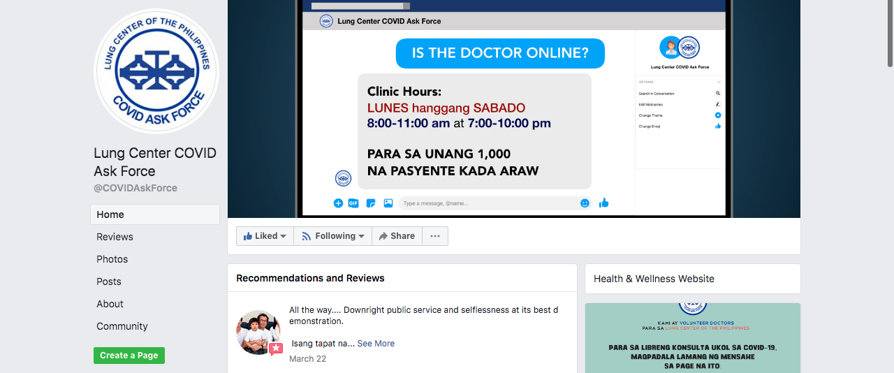

# Staff

## **Overview**

The first component of the 4 S framework relates to “staff”. Here we discuss task shifting, community health workers, and telemedicine as interventions to alleviate human resource constraints during the pandemic. These and other solutions to expand the pandemic healthcare workforce are being actively investigated.

## **Task Shifting**

Task shifting is a mechanism employed in resource-constrained settings around the world to increase the effective number of clinical staff available to meet a population’s health demands. During the COVID-19 pandemic, systems from all income levels have strained to maintain an adequate healthcare worker capacity to treat the surge of COVID-19 patients in addition to all other patients. 

The [World Health Organization](https://www.who.int/healthsystems/TTR-TaskShifting.pdf?ua=1) defines task shifting as “the rational redistribution of tasks among health workforce teams…from highly qualified health workers to health workers with shorter training and fewer qualifications in order to make more efficient use of the available human resources for health.” The WHO recommends that task shifting be undertaken in parallel with efforts to strengthen the healthcare workforce capacity, and only after consultation with relevant stakeholders, including patients, to ensure needs are appropriately met. Per [WHO guidelines](https://www.who.int/healthsystems/TTR-TaskShifting.pdf?ua=1), successful implementation of task shifting requires knowledge of:

1. the available human resources for healthcare
2. the gaps in care provision
3. the extent to which task shifting is already taking place
4. the quality assurance mechanisms that already exist

Task shifting is typically regulated by existing institutions \(e.g. licensing boards, professional societies, local, state, and national governments\). Regulations can be modified to allow extension of the scope of practice or creation of new cadres within the healthcare system. Existing training and quality assurance programs may be modified to ensure that roles and core competencies are clearly defined for new or expanded positions. Furthermore, supervision by healthcare workers with higher levels of qualification is essential \(e.g. anesthesiologist supervises multiple nurse anesthetists\). In this way, more highly qualified healthcare workers are available for cases requiring a higher level of skill or expertise. Finally, essential health services cannot be sustainably provided on a voluntary basis, so it is [important to ensure workers are compensated](https://www.who.int/healthsystems/TTR-TaskShifting.pdf?ua=1) and programs are adequately financed.

### **Examples of task shifting in COVID-19**

By mid-March, Italian hospitals were witnessing surges of COVID-19 patients that overwhelmed their existing capacity. As one mechanism to address the insufficient supply of care providers, Italy [expedited graduation for senior medical students](https://www.cnn.com/2020/03/30/europe/italy-young-doctors-coronavirus-intl/index.html) so that they could serve where need was greatest. Italy also requested that all Italian doctors who had completed their education in Italy and were practicing abroad return to Italy to work.

_Thought Question:_ 

* Which of these policies from Italy incorporated task shifting? What tasks were shifted, and what qualifications were waived?

As the COVID-19 burden grows exponentially in the U.S., multiple task-shifting measures have been enacted to boost numbers of healthcare workers and expand their scope of practice. In New York, the U.S. epicenter as of April, an Executive Order from the governor [relaxed a number of restrictions](https://www.governor.ny.gov/news/no-20210-continuing-temporary-suspension-and-modification-laws-relating-disaster-emergency) on health professionals’ scope of practice. This order allows nurse anesthetists, physician assistants, specialist assistants, and nurse practitioners to practice without the supervision of a physician. In addition, the state has allowed nurses to order testing for COVID-19 without the need for a signed order from a physician. Plans have also been developed to [create ICU teams from non-critical care attending physicians and housestaff](https://www1.nyc.gov/assets/doh/downloads/pdf/em/icuce-tool.pdf) to meet surge demand. Attending physicians and residents at high risk for severe COVID-19 have been furloughed and serve as “virtual rounders” who assist with hospital documentation tasks including progress notes and discharge summaries. Medical schools in New York and Massachusetts have [accelerated graduation of 4th year medical students](https://www.nytimes.com/2020/03/26/health/coronavirus-medical-students-graduation.html) and distributed emergency 90-day limited licenses, with plans to increase the number of licensed providers available to care for COVID-19 patients. Early graduation in the U.S. [has been implemented in the past](https://www.aamc.org/news-insights/itching-get-back-medical-students-graduate-early-join-fight), during the 1918 Influenza pandemic, and during World War II. 

_Thought Question:_ 

* How would you organize an ICU team from a group of doctors, nurses, mid-level providers, clinical assistants, and technicians who have not worked in an ICU before? Who would provide immediate and ultimate supervision of each member of the team?

## **Community Health Workers**

A community health worker \(CHW\) is a community member identified as a point of contact for health needs at the local level, helping to provide basic health and medical care within their own community. Though the terminology of a CHW varies by context \(e.g., health worker, community health promoter, etc.\) and [scopes of practice differ across settings](https://www.ncbi.nlm.nih.gov/pmc/articles/PMC3260896), they are typically capable of providing preventive care, health promotion, and rehabilitative care within their own community. 

  
In many LMIC settings that have historically lacked sufficient medical personnel to meet population health demands, CHWs have helped to fill a crucial gap. Compensation for CHWs varies by context. Some countries provide a salary. Other countries provide recognition for CHWs’ service and offer certain incentives such as access to health insurance or mobile phones. Some level of standardized training is generally offered to equip CHWs to perform their expected duties.

### **CHWs in the COVID-19 response - Rwanda case study**

Rwanda - a country of 12 million people in Sub-Saharan Africa - illustrates how a CHW network can be deployed effectively for the COVID-19 response. Much has been written about the growth of Rwanda’s [CHW program](http://www.chwcentral.org/sites/default/files/Rwanda%20-%20Rwanda%27s%20Community%20Health%20Worker%20Program.pdf) in light of the gaps it helped to fill following the devastating 1994 Genocide against the Tutsi. As of 2020, there are more than 45,000 CHWs operating at the village level who provide the first line of health service delivery. In Rwanda, villages comprise between 100 and 200 households. There are [three CHWs in each village](https://dash.harvard.edu/bitstream/handle/1/14065527/4320528.pdf?sequence=1&isAllowed=y): a male-female CHW pair \(called binômes\) providing basic care and integrated community case management \(iCCM\) of childhood illness, and a CHW in charge of maternal health, called an ASM \(Agent de Santé Maternelle\). While CHWs are elected  by the members of their village, this position is voluntary and considered to be an honor in Rwanda. CHWs are also provided a series of incentives, including access to the national community-based insurance scheme \(Mutuelles de Santé\), tools such as a mobile phone with airtime for communication, access to CHW co-operatives, and training by the Ministry of Health. Finally, CHWs receive a nominal amount of financial support through the country’s performance-based financing program. 

Due to the distribution of CHWs throughout Rwanda, they are the first people to be contacted at the local level by any person with suspected symptoms of COVID-19. Once a CHW is made aware of a suspected case, they contact coordinating health officials via SMS \(with the phones they are provided with as a CHW\), who then alert those responsible for contact tracing so that containment efforts are optimized. Also, SMS alerts sent by CHWs are integrated into a national health information technology \(HIT\) system that allows for real-time national information sharing, which in turn allows smooth coordination by regional and national authorities. The advantage of an SMS-based system is that it is a practical, rapid method for CHWs to notify health officials of emerging cases in real time. Because the Ministry of Health pays the cost linked to the telephone communications, there are no financial charges incurred by the CHW. Further, the system is not reliant on having a stable internet connection in remote areas, thereby helping to ensure a rapid notification system across the entire country. 

### **Leveraging the CHW model to expand capacity in COVID-19 response**

Rwanda and many other countries have robust CHW programs that existed prior to the COVID-19 pandemic, and are ready to integrate any new threat at the community level. Countries that have not historically relied on a cohesive CHW structure can draw important lessons from these systems as they recruit community members for their own COVID-19 responses. The health network that emerges may be worth sustaining well beyond the current crisis.

As seen in [Table 1](http://lastmilehealth.org/wp-content/uploads/2020/03/Prevent-Detect-Respond-Rapidly-expanding-healthcare-teams-through-community-health-workers-in-the-fight-against-COVID-19.pdf), CHWs can contribute to the COVID-19 response in a variety of ways, building on their previous tasks in their community. They may be particularly helpful in detecting and tracing suspected cases, educating peers about prevention, quarantine, isolation, and lockdown protocols put in place by public health officials, and continuing chronic disease care. In the U.S., community health care centers have drastically reduced in-person appointments to adhere to social distancing and stay-at-home orders. In some settings, these staff have been redirected to COVID-19 clinical teams, responding to high-risk patients over the phone. CHWs can assess risk for patients and provide appropriate escalation of care. One example, from Boston University, involved training [CHWs for HIV care teams](https://targethiv.org/chw), where they formed an essential bridge between healthcare organizations and communities. Another example, a partnership between the Massachusetts government and [Partners in Health](https://www.pih.org/article/pih-partners-mass-governors-office-covid-19-response), involves developing a CHW workforce that will scale up [contact tracing](https://www.wbur.org/npr/845026655/what-it-takes-to-be-a-contact-tracer). In the United Kingdom, a model has been proposed to [train CHWs to support people in their homes or virtually](https://www.thelancet.com/journals/lancet/article/PIIS0140-6736%2820%2930735-2/fulltext) by assessing food and medication supplies and other needs for vulnerable people. In summary, a novel CHW program serves as a promising method to redistribute human resources in strained healthcare systems that lack adequate capacity for the surge in demand.

|  **** | **Table 1: Potential Roles of Community Health Workers in the COVID-19 Pandemic** |
| :--- | :--- |
| **Prevent** | Educate communities regarding signs, symptoms, and transmission routes and  promote personal protective measures. |
|  | Organize hand hygiene stations in communities and health facilities. |
|  | Support facility-based infection prevention through triage areas and PPE use. |
|  | Support preparation for future interventions like vaccines through outreach. |
| **Detect** | Identify signs/symptoms in community members and support safe sample collection and rapid transport to reduce risk of nosocomial transmission. |
| **Respond** | Communicate rapidly and effectively to residents. |
|  | Support self-isolation while ensuring critical food, medical and social support. |
|  | Monitor patients for clinical deterioration and rapidly refer when needed |
|  | Support contact tracing, symptom reporting, and access to testing and treatment |
|  | Implement disinfection of high-risk surfaces |
|  | Sustain routine primary healthcare services \(vaccines, diarrhea, malaria, etc\) |

## **Telemedicine**

As a final example of how to increase staff availability in the setting of COVID-19, we focus on telemedicine. This mechanism for interacting with patients virtually is not a new technology; its implementation has been variable for multifaceted reasons. Below, we provide an overview of telemedicine, evaluate advantages and disadvantages of this technology, and detail how regulations have been relaxed to promote its use in the COVID-19 response.

### **Providing care or triage without increasing transmission risk**

Prior to COVID-19, the U.S. had witnessed [varying degrees of telemedicine utilization](https://aspe.hhs.gov/system/files/pdf/206751/TelemedicineE-HealthReport.pdf) due to complex regulatory, policy, and reimbursement challenges. As discussed in [Module 3](https://curriculum.covidstudentresponse.org/module-3-disparities-policy-socioeconomic-effects/implication-for-the-healthcare-system-beyond-covid-19-patients#routine-chronic-and-non-essential-care-and-telemedicine), in the setting of the pandemic, federal and state policy [increased reimbursement mechanisms](https://www.ajmc.com/journals/issue/2020/2020-vol26-n4/incorporating-telemedicine-as-part-of-covid19-outbreak-response-systems) to ensure that telemedicine could be employed as a mechanism for patients to continue seeking care without having to physically attend appointments. For instance, [Jefferson Health](https://www.aamc.org/news-insights/delivering-more-care-remotely-will-be-critical-covid-19-races-through-communities) in the U.S. has increased their telemedicine visits from a few dozen per week to 500-600 visits per day, a tenfold surge in demand for screening. The U.S. Congress recently passed the [CARES Act](https://www.congress.gov/116/bills/hr748/BILLS-116hr748enr.pdf), which allows Medicare reimbursement for health centers and rural health clinics for the remainder of the crisis and for expansion of telemedicine. In the U.S., HIPAA \(a law that provides protections for personal health information among many other things\) compliance guidelines for telemedicine have been relaxed. It is now possible to use free or low-cost video communication tools such as Apple FaceTime, Facebook Messenger, Skype, and Zoom. Another example discussed in [Module 4](https://curriculum.covidstudentresponse.org/module-4-mental-health-in-the-time-of-covid-19/evolving-clinical-practices-in-mental-healthcare#the-rise-of-telehealth) is the use of telemedicine for mental healthcare in China. Major limitations include access to a device with audio and camera, and education in using electronic platforms, which may disproportionately affect patients who lack access to this technology. Additionally, development of guidelines on what will require an in-person visit must be set - for example, a change in condition, requiring a physical exam, or lack of interpreters \(although remote phone interpreters have helped to fill this last gap\). While there are logistical concerns, patients with difficulty in transportation or accessibility to attend in-person visits may benefit from this rise in telemedicine.

To provide an example from another context of how telemedicine has been utilized in the face of the COVID-19 pandemic, we provide a case study from the Philippines.

As the number of COVID-19 cases grows in the Philippines and strains its health sector, several medical groups and physicians have created a [Facebook-based platform for online consultation](https://www.facebook.com/COVIDAskForce/) services called the “Lung Center COVID Ask Force”. It primarily aims to triage patients with possible COVID-19-related complaints. Every Monday to Saturday, around 625 volunteer doctors - with the help of student volunteers from the Ateneo School of Medicine and Public Health - provide online consultation services to the first 1,000 patients who message the Facebook page that day. Additionally, the Lung Center COVID Ask Force also posts infographics based on frequently asked questions. These serve as educational materials that people can easily access without needing to consult a doctor.

\*\*\*\*

