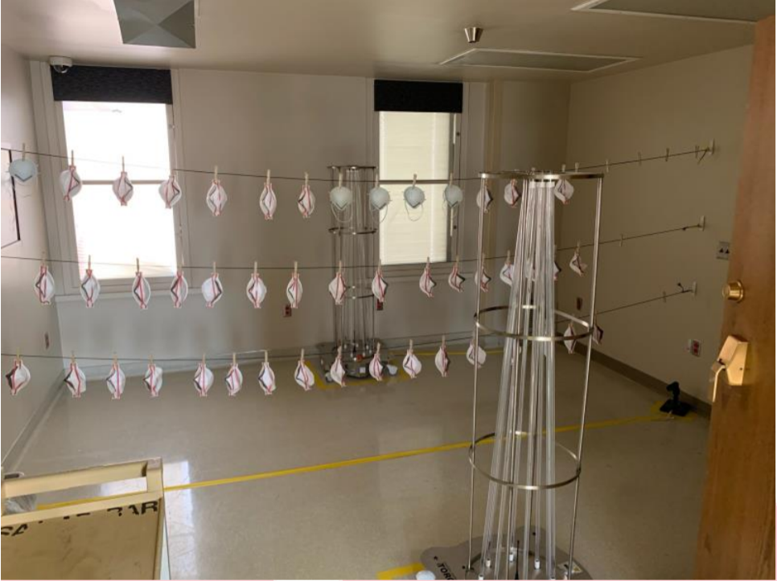
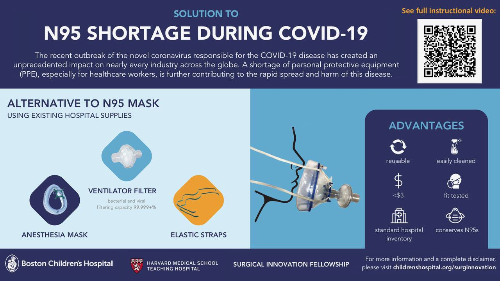
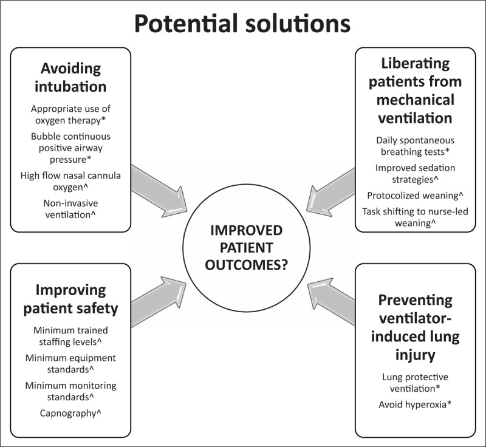

# Stuff

In this section, we explore the second component of the 4 S framework: stuff. Healthcare systems including China, Italy, and the U.S. have struggled to maintain sufficient medical supplies during peak need of the pandemic. We describe a few examples that illuminate the importance of having the appropriate materials to respond to emerging health needs. In addition to those discussed below, testing is a critical need as well; it is discussed in detail in [Module 1](https://curriculum.covidstudentresponse.org/module-1-from-bench-to-bedside). The inclusion of point-of-care ultrasound testing, which can used to identify characteristic COVID-related lung findings, may be critical particularly in lower-resourced settings where widespread PCR-based testing may not be feasible.

## **Focus \#1: Personal Protective Equipment**

As discussed in [Module 6](https://curriculum.covidstudentresponse.org/module-5-training-for-medical-student-specific-roles), personal protective equipment \(PPE\) is essential to the safety of healthcare professionals and prevention of virus spread in clinical environments. The Centers for Disease Control and Prevention \(CDC\), anticipating critical shortages, [issued recommendations](https://www.cdc.gov/coronavirus/2019-ncov/hcp/ppe-strategy/face-masks.html#crisis-capacity) for prolonged use and re-use of masks and face shields, use after expiration dates, and alternatives like cloth masks or bandanas when no masks are available. However, they acknowledge that some of these practices are less effective than conventional PPE. In LMICs where such shortages are more common at baseline, the pandemic makes adequate protection for providers and patients difficult. Innovators have been considering how to address this need. Here we summarize examples of such potential innovations.

### PPE innovations from the Philippines: “Do it yourself” \(DIY\) face shields

Due to an inadequate supply of PPE in the Philippines, student organizations and youth groups have created alternative means to procure them. This has led to DIY face shields designed and produced by graduating medical interns from the [Ateneo School of Medicine & Public Health](https://www.facebook.com/asmph2020/posts/636928666883996).

This initiative has been adopted by other institutions under the umbrella of Ateneo Professional Schools \(APS\), including law and business schools. Its rising popularity has prompted many independent groups to create their own versions of the face shields in order to aid in the procurement of much-needed PPE in their respective localities. Through this widespread initiative, thousands of face shields have been donated to local medical systems. These DIY face shields can be made using recycled [plastic bottles](https://m.youtube.com/watch?v=1S83fjKY19w&t=16s) or sheets of acetate, recycled bubble wrap or strips of foam, garter, and common office supplies. A tutorial video can be accessed [here](http://tinyurl.com/ASMPH-DIY-FaceShields).

### Acrylic aerosol box

The aerosol box, [originally designed by Taiwan-based anesthesiologist Dr. Lai Hsien-yung](https://www.taiwannews.com.tw/en/news/3902435), was developed to provide additional protection during aerosol-generating procedures \(AGPs\) like endotracheal intubation. This is of particular importance in COVID-19, as rapid clinical deterioration often necessitates rapid intubation. Performing AGPs places practitioners at higher risk of viral exposure and thus requires use of additional barriers for protection.

The protective tool is designed to be placed over the patient’s head with two holes to allow a physician’s hands to be inserted to perform procedures. The clear acrylic or poly-carbonate material makes for an inexpensive but effective barrier without interfering with visibility.

Anton Legaspi, a designer, and his sister, Frances Legaspi, an emergency room physician at Antipolo Doctors Hospital, spotted the device on social media and sought permission to [replicate it in the Philippines.](https://www.taiwannews.com.tw/en/news/3903467) Many independent groups in the country began mass-producing the aerosol box to meet PPE demands for critical care settings. The design continues to be improved, including [modified dimensions](https://www.facebook.com/anton.legaspi/posts/10158096249334861) to bring costs down from US$66 to US$29 per unit, larger holes to facilitate easier arm movement, and [adjusting dimensions to add a slanted viewing pane](https://www.facebook.com/everythingacrylic.ph/posts/1293347680850964).

The [original blueprint](https://sites.google.com/view/aerosolbox/design) by Dr. Hsien-yung is free for non-commercial purposes with proper attribution. Demonstration videos can be found here:

* [Aerosol Box for Use During Intubation & Extubation of COVID-19 Patients](https://www.youtube.com/watch?v=0tjtN_9HwLI)
* [Simulation Using Aerosol Box – Video Laryngoscopy](https://www.facebook.com/NeyNeyDMMD/videos/3119422944748819)
* [Modified aerosol box by Everything Acrylic](https://www.facebook.com/watch/?v=1059761341046808)

### Addressing PPE shortages in the United States

**Mask decontamination and re-use** has been considered in the U.S. for past infectious outbreaks. Two important questions that must be addressed with this process include:   
  
1\) Does decontamination impair the integrity of masks?  
2\) Is the effectiveness for eliminating viruses high enough? 

First, the maximum survival time of about 72 hours of SARS-CoV-2 means that masks could be re-used without sterilization. For unsoiled masks, the CDC suggests a [daily rotation of five masks](https://www.sages.org/n-95-re-use-instructions/), either hanging masks between use or placing them in breathable paper bags between uses, such that any virus would decompose before re-use. 

A number of other decontamination methods have been explored with [varied success](https://doi.org/10.1093/annhyg/mep070). Microwave oven irradiation, in some cases, melts materials following prolonged exposure, while bleach damages filtration efficacy and leaves a toxic scent which detracts from the user experience, making neither a robust option for widespread decontamination. Ultraviolet germicidal irradiation \(UVGI\), ethylene oxide, and vaporized hydrogen peroxide \(VHP\) all preserve the integrity of mask filtration. However, UVGI  [decreases the structural integrity](https://www.tandfonline.com/doi/full/10.1080/15459624.2015.1018518) of masks over time which will limit the number of disinfection cycles per mask.

The U.S. Environmental Protection Agency includes hydrogen peroxide in a [list of disinfectants](https://www.epa.gov/pesticide-registration/list-n-disinfectants-use-against-sars-cov-2) effective against SARS-CoV-2. A group at [Duke University](https://corporate.dukehealth.org/news-listing/duke-starts-innovative-decontamination-n95-masks-help-relieve-shortages?h=nl) developed a method to disinfect masks using a vaporized hydrogen peroxide solution in a room with masks hanging on clothes-lines to be fully exposed. 

High energy [UV-C radiation](https://www.sciencedirect.com/science/article/pii/S016609340400179X) has been shown to kill SARS-CoV and MERS, and it is expected to work in SARS-CoV-2 as well given their structural similarity. A group at the [University of Nebraska](https://www.nebraskamed.com/sites/default/files/documents/covid-19/n-95-decon-process.pdf) developed a decontamination method by hanging up masks between two large UV-C sources with good results \(see image below\). There are also some industrial approaches to mask sterilization, like those currently being used in [Boston hospitals](https://www.bostonglobe.com/2020/04/02/metro/boston-hospitals-getting-game-changer-machine-that-sterilizes-80000-protective-masks-day/).

It is woth mentioning a novel strategy: microwaving. [Zulauf et al.](https://mbio.asm.org/content/11/3/e00997-20) were pioneers in the use of this approach. They used a rubber band, a glass container, mesh from a commercial produce bag, and a 1,000-watt microwave to decontaminate an N95 respirator from MS2 phages \(surrogates for SARS-CoV-2\). After a single use for 3 minutes, they found that there was a greater than 99.99% reduction of plaque-forming units \(PFU\) \(a PFU is a measure of concentration used in virology\). Even after 20 sequential cycles, fit and function of the respirator were preserved. Discoveries like these are essential because **advancement is not always within the creation of new things, but in taking what is and transforming it.** 

Given the shortages of conventional N-95 respirators and surgical masks, **unconventional mask alternatives** are being widely made. **I**n 2015, [McIntyre et al.](https://bmjopen.bmj.com/content/bmjopen/5/4/e006577.full.pdf) showed in a large-scale randomized clinical trial that cloth face masks were inferior to medical ones in preventing influenza transmission among healthcare workers, mainly because the latter have larger number of layers, a finer weave and a better fit. Four years later, the N95 masks were assessed against medical masks [in a cluster randomized clinical trial](https://www.ncbi.nlm.nih.gov/pmc/articles/PMC6724169/), evaluating their effectiveness in a clinical setting; it was found that N95 respirators are better in preventing aerosols, although no difference was found in preventing influenza infection. In other words, N95 respirators are clinically similar to wearing medical masks, which in turn are superior preventing the transmission of different virus. 

**Different materials; different levels of protection**

Cloth can be expected to block droplets and aerosols, even if it does not stop isolated virions. In comparison, the filtration efficiency in a single layer of different types of cotton in bioaerosols \(0.2 μm\) was 43-94% compared to 98-99% in disposable medical masks. [Davies et al.](https://www.ncbi.nlm.nih.gov/pmc/articles/PMC7108646/pdf/S1935789313000438a.pdf) delved into this topic comparing the filtering efficiency of different materials. They concluded that despite the overall superiority in preventing bacterial and viral infections of the surgical masks, when it came to homemade textiles, pillowcases and 100% cotton fabrics were sufficient enough for their purpose. These experiments, useful as they are, are not geared towards COVID-19. For this reason, [Rodríguez-Palacios et al.](https://www.ncbi.nlm.nih.gov/pmc/articles/PMC7267001/pdf/fmed-07-00260.pdf) assessed household textiles to quantify effective environmental droplet barriers. After spraying microorganisms at six types of fabrics, they found that when using two-layered textiles as much as 99.7% of the ejection of micro droplets could be retained, leaving a circumferential contamination of approximately 0.3%. 

Another approach, led by [University of Florida Anesthesiology](https://m.ufhealth.org/news/2020/uf-health-anesthesiology-team-devises-respirator-mask-made-existing-hospital-materials?fbclid=IwAR0-w6cmc8EcczT-Inkd0zL7KP8msEbQDEYJh_hITMD8UWBxL4N5wO0kDyA), is encouraging the use of Halyard H600 two-ply spun polypropylene to make masks with minimal particulate penetration. Researchers at Boston Children’s Hospital also produced a washable, inexpensive mask from available hospital materials, as seen [below](https://www.forbes.com/sites/jacquelyncorley/2020/03/23/researchers-devise-new-breakthrough-to-protect-healthcare-workers-from-coronavirus/#3c2ced712102) or at this [link for a video description](https://www.youtube.com/watch?v=Es_iY5WJdmI).

When it comes to giving advice, healthcare workers should make [training](https://www.ncbi.nlm.nih.gov/pmc/articles/PMC7108646/pdf/S1935789313000438a.pdf) in usage and correct fitting of masks a priority. [Inclining the head and body downward during sneezing](https://www.ncbi.nlm.nih.gov/pmc/articles/PMC7267001/pdf/fmed-07-00260.pdf), in addition to having a face mask, could help contain the droplet contamination’s trajectory due to a sneeze’s dispersion dynamics. [Ironing masks ](https://www.ncbi.nlm.nih.gov/pmc/articles/PMC7267001/pdf/fmed-07-00260.pdf)be beneficial as well, because humid and dry heat produced by an iron destroy viruses and spore producing bacteria withouth affecting the textile integrity of face covers. Finally, [washing textiles](https://www.ncbi.nlm.nih.gov/pmc/articles/PMC7267001/pdf/fmed-07-00260.pdf) between uses could eliminate COVID-19 from face masks and other coverings; it has been shown that SARS-CoV-2 can be denaturalized by heat when exposed to 70°C for 5 minutes, bleach, when exposed at a concentration of 1:49 for 5 minutes, or detergents when exposed for 20 minutes.

_Thought Questions:_ 

* How could cloth masks be improved to be equivalent to medical-grade masks? What would you do to mass-produce them during a shortage?
* Thought question: What can you teach your family members and friends about homemade Personal Protective Equipment? Is there something you can improve at home to keep everyone safer?

### Optimizing face mask usage

Face masks are both effective in preventing transmission and preventing infection with SARS-CoV-2. An uncovered cough, for example, can cause droplets to travel 12 feet within approximately 50 seconds. However, according to [Verma, et al. \(2020\)](https://aip.scitation.org/doi/10.1063/5.0016018), with even just a properly fitting homemade cotton mask made of multiple layers, droplets only travel about 2.5 inches. 

Evidence has shown the use of face masks is associated with a 70% risk reduction of acquiring COVID-19 infection. The effectiveness of any given mask is, in large part, based on its filtration material. The US National Institute for Occupational Safety and Health \(NIOSH\) N95 classification established the “95” because, when subjected to testing, the respirator blocked 95% of small \(0.3μm\) test particles. Meanwhile, a [publication by the WHO](https://apps.who.int/iris/bitstream/handle/10665/332293/WHO-2019-nCov-IPC_Masks-2020.4-eng.pdf) on the use of masks in the context of COVID-19 highlights that the filtration of cloth fabrics –also referred to as “non-medical masks” – varies between 0.7% and 60%, depending on the type of material, the number of layers, maintenance and fit, while the filtration of surgical masks – also referred to as “medical masks” – is at least 95%. Considering the lower performance of non-medical masks, the WHO emphasizes that these “should only be considered for source control \(used by infected persons\) in community settings and not for prevention”, and that their use “should always be accompanied by frequent hand hygiene and physical distancing.” 

In January 2021, the CDC conducted [experimental simulations](https://www.cdc.gov/mmwr/volumes/70/wr/mm7007e1.htm?s_cid=mm7007e1_x#F1_down) on the efficacy of double-masking against SARS-CoV-2 transmission. These assessed the extent to which two simple modifications to medical masks could reduce risks of exposure to SARS CoV-2 droplet particles by individuals wearing the PPE in their daily lives. 

1. **Double-masking**: wearing a cloth mask tightly on top of a surgical mask; the surgical mask acts as a filter and the cloth mask provides an additional layer of filtration while improving the fit.
2. **Knotted-and-tucked masks:** knotting the ear loops of a medical-procedure mask where the loops attach to the mask’s edges and then tucking in and flattening the extra material close to the face. 

[Pan et al. \(2020\)](https://www.medrxiv.org/content/10.1101/2020.11.18.20233353v1), after summarizing available [evidence](https://www.cell.com/med/pdf/S2666-6340%2820%2930072-6.pdf) on face masks used by the public for coronavirus prevention, introduced a third variation of face mask usage that helps achieve &gt;90% protection against &gt;1 μm particles: wearing a **three-layer mask** with outer layers consisting of a flexible, tightly woven fabric that can conform well to the face and a middle layer consisting of a non-woven, high-efficiency filter material \(e.g., vacuum bag material\).

The [CDC concluded ](https://www.cdc.gov/mmwr/volumes/70/wr/mm7007e1.htm?s_cid=mm7007e1_x#F1_down)that the wearer’s exposure was maximally reduced \(&gt;95%\) when both the source and wearer used the modified medical-procedure masks. Other recent studies conducted similar protocols to evaluate the use of a cloth mask over a medical-procedure mask, the use of knotting and tucking the medical-procedure mask, and the use of mask filters to improve the fit. Results were similar throughout experiments and concluded that filtration efficacy \(&gt;90%\) was better achieved applying all methods. A study by the CDC aimed to quantify aerosol penetration during breathing under the following scenarios: use of a medical mask alone, a cloth mask alone, a cloth over a medical-procedure mask \(double-masking\) and knotting and tucking a mask. They found that a unknotted medical mask alone blocked 56.1% of particles from a simulated cough, and a cloth mask alone blocked 51.4%. The double-masking method blocked 85.4% of cough particles, while the knotted-and-tucked method blocked 77.0%. 

## **Focus \#2: Oxygen Administration**

Another example of the “stuff” that is required to care for COVID-19  patients is oxygen and the means to deliver it. Oxygen delivery is a critical need given that the cardinal manifestation of COVID-19 prompting hospitalization is hypoxemic respiratory failure progressing to acute respiratory distress syndrome \(ARDS\). As global reports suggest, approximately 15% of patients with COVID-19 have severe illness requiring oxygen therapy, and 5% of them will develop critical illness requiring intensive care unit \(ICU\) treatment. Furthermore, most critically ill patients with COVID-19 require mechanical ventilation. Healthcare facilities are required to be equipped with pulse oximeters and operating oxygen systems that include single-use oxygen supply interfaces \(nasal cannulas, nasal prongs, simple face masks, and masks with reservoir bag\), highlighting that only [medical-grade, high-quality oxygen](https://www.who.int/publications/i/item/oxygen-sources-and-distribution-for-covid-19-treatment-centres) should be administered to patients. Supplemental oxygen therapy must be applied immediately to patients with[ Severe Acute Respiratory Infections \(SARI\)](https://www.who.int/docs/default-source/coronaviruse/clinical-management-of-novel-cov.pdf) and respiratory distress, hypoxemia, or shock, for a target [SpO2 of &gt; 94%](https://www.england.nhs.uk/coronavirus/wp-content/uploads/sites/52/2020/03/specialty-guide-NIV-respiratory-support-and-coronavirus-v3.pdf). 

Successful oxygen treatment requires an **oxygen source**, either from oxygen cylinders, oxygen concentrators, or liquid oxygen. Choosing the [appropriate oxygen source](https://apps.who.int/iris/bitstream/handle/10665/329874/9789241516914-eng.pdf?ua=1) depends on many factors, for example: the amount of oxygen needed, the available infrastructure, electricity availability, cost, capacity, and supply chain for local production of medicinal gases, as well as access to maintenance services and spare parts, to name a few. A possible [decision tree](https://pubmed.ncbi.nlm.nih.gov/19876543/) for deciding between the use of oxygen cylinders and oxygen concentrators in resource-limited settings based on a cost-effectiveness analysis done in Gambia is shown below.

Most hospitals and healthcare facilities in high-income countries \(HICs\) use [liquid oxygen](https://www.chthealthcare.com/blog/medical-gas-systems). Two major medical gas companies that provide liquid oxygen and oxygen cylinders in the U.S. and around the globe are facing increasing demand for their products. These global medical gas companies are currently able to manage this demand and have started [preparing their supply chain](https://www.wsj.com/articles/gas-suppliers-face-soaring-demand-for-oxygen-to-treat-coronavirus-patients-11585223338) to address potential future bottlenecks. Nevertheless, the most popular source of oxygen storage used in healthcare facilities are oxygen [cylinders](https://apps.who.int/iris/bitstream/handle/10665/329874/9789241516914-eng.pdf?ua=1). A [medical oxygen cylinder](https://apps.who.int/iris/bitstream/handle/10665/329874/9789241516914-eng.pdf?ua=1) is a refillable cylindrical storage vessel used to store and transport oxygen in the compressed gas form. 

Healthcare facilities in resource-limited settings have many barriers to delivering oxygen to patients. According to a 2010 survey of health care facilities in 12 African countries, less than half reported uninterrupted oxygen access, and less than a quarter had an oxygen concentrator. Only 35% of these health care facilities have [access](https://www.ncbi.nlm.nih.gov/pubmed/20818088) to electricity. In another study in the [_Lancet_ from 2010](https://www.thelancet.com/journals/lancet/article/PIIS0140-6736%2810%2960392-3/fulltext), 19% of 77,700 surveyed surgical rooms, with a geographically and demographically diverse representation from over 50 countries, did not have access to pulse oximetry. In these settings, an advantage of oxygen cylinders is that they **fit perfectly within low-income countries \(LICs\) facilities, where power supply is intermittent or unreliable**, mainly because it doesn’t require electricity. Reported disadvantages of such oxygen source are: 

* Require a supply chain and transportation for refilling. 
* Require functional flow meters.
* May have [leakages](https://www.researchgate.net/publication/273256731_The_maintenance_needs_of_oxygen_concentrators_in_low-resource_settings_and_implications_for_technician_training_Experience_from_The_Gambia). 

An additional alternative for LICs are oxygen concentrators. However, they require electricity to operate and [technicians](https://bmchealthservres.biomedcentral.com/articles/10.1186/s12913-019-4129-7) to repair them. If electricity is reliable, oxygen concentrators are more cost-effective than oxygen cylinders. In settings with unreliable electricity, oxygen cylinders may be [preferred](https://www.ncbi.nlm.nih.gov/pubmed/19876543). 

_Thought Questions:_

* Should governments of HICs start to prepare for oxygen shortages? How should they do so? Should they favor oxygen concentrators or cylinders?
* What about LICs that don’t have access to all the complete oxygen systems? How should they compensate for this deficiency?

## **Focus \#3: Respiratory Support**

Along the lines of oxygen, respiratory support is also a critical need for COVID-19. Here we summarize well-known estimates of ventilator shortages in HICs, explore implications for LMICs, and provide examples of innovations being explored to address this gap in supply versus demand.

### Mechanical ventilators

Currently there are an estimated [60,000 to 160,000 ventilators](https://www.nejm.org/doi/full/10.1056/NEJMp2006141) in the U.S. However, it is estimated that the COVID-19 pandemic may require up to [1 million ventilators](https://www.nytimes.com/2020/03/13/us/coronavirus-deaths-estimate.html). In addition to the shortage of ventilator equipment and insufficient production of [ventilator parts and consumables](https://www.ncbi.nlm.nih.gov/pmc/articles/PMC6319564/), the U.S. may face other challenges relating to “Staff” who can operate ventilators, including a lack of skilled respiratory therapists and biomedical engineers to support ventilator use and function. Furthermore, currently, procedures that could decrease the need for intubation and increase the [safety of extubation](https://erj.ersjournals.com/content/50/2/1602426), such as high-flow nasal cannula \(HFNC\), CPAP, and BiPAP, are relatively contraindicated due to the [risk of aerosolization of](https://www.wfsahq.org/resources/coronavirus) [SARS-CoV-2](https://www.wfsahq.org/resources/coronavirus).

Resource-limited settings, such as rural areas in LMICs, have long struggled with the emerging scarcity that HICs are just now facing due to the surge of critically ill COVID-19 patients, including lack of [ICU beds](https://journals.plos.org/plosone/article?id=10.1371/journal.pone.0116949), lack of ventilatory equipment, lack of skilled technicians to operate ventilators, and an inability to repair ventilators. Healthcare facilities in LMICs may face additional challenges such as inability to monitor patients’ oxygen saturations or arterial blood gas readings, lack of portable x-rays, inconsistent access to electricity, and the aforementioned challenges with [oxygen delivery](https://www.ncbi.nlm.nih.gov/pmc/articles/PMC6319564/). Some studies have shown evidence of high mortality rates even among the relatively few patients who are able to access invasive [mechanical ventilation](https://www.ncbi.nlm.nih.gov/pmc/articles/PMC6319564/). This is often due to a lack of or inadequate access to ancillary support services, such as [portable x-rays, sedation](https://www.apsf.org/article/improving-anesthetic-safety-in-low-middle-income-countries-a-different-challenge/), and [suction devices](https://www.ncbi.nlm.nih.gov/pmc/articles/PMC5469676/).

Given this problem, experts explored a range of frameworks for practical guidance on administering respiratory support for those who are critically ill in resource-limited settings. One such framework proposed by [Inglis, Ayebale, and Sch](https://www.ncbi.nlm.nih.gov/pmc/articles/PMC6319564/)[ultz](https://www.ncbi.nlm.nih.gov/pmc/articles/PMC6319564/) is found in the figure below.

#### _Case study \#1: Reconfiguring machines for sleep apnea into hospital ventilators_

A team of physicians at the[ Mount Sinai Health System](https://health.mountsinai.org/blog/mount-sinai-turns-hundreds-of-machines-for-sleep-apnea-into-hospital-ventilators-shares-instructions-worldwide/) have reconfigured hundreds of donated machines \(200 ResMed VPAP ST machines\) typically used at home for sleep apnea, with the purpose of deploying them as ventilators to be used for severely ill patients who are hospitalized with COVID-19. The Mount Sinai team made three important modifications to the VPAP ST machines: 1\) connection to an endotracheal tube replaced the typical mask that can present a risk of COVID-19 aerosolization, 2\) alarms were installed that can alert clinicians if there is a problem with air flow, 3\) doctors and respiratory therapists were enabled to view and control the machine’s settings from outside the patient's room, so they do not need to enter to make minor adjustments. According to Drew Copeland, Director of Operations for the Sleep Program at the Mount Sinai Health System, “any type of high-performing sleep device that delivers a comparable level of pressure to the ResMed VPAP ST model can work as a repurposed ventilator.”

Mount Sinai has shared the protocols and instructions with the greater New York Hospital Association and the American Thoracic Society, as well as with other hospitals that are dealing with a national shortage of invasive ventilators during this pandemic.

_Thought Question:_

* Mount Sinai has had a donation of VPAP machines, which are expensive. The reconfiguration of VPAP machines is showing good results as an option for other hospitals all over the world to reconfigure these machines into ventilators. However, what should the LMIC's without donations do given the cost of these VPAP machines? How could they have access to this solution?

#### _Case study \#2: Friendly ventilador_

As another example of innovation to address the shortage of ventiladors, the israeli government took advantage of Israel Aerospace Industries as a place to design, manufacture and mass produce the [portable ventilators](https://www.israel21c.org/israel-fast-tracks-ventilator-innovations-for-covid-19-care/) shown in the image. Their main advantage is that they can be used outside the hospital setting and are suitable for chronic life support ventilation in COVID-19 patients. [This user-friendly ventilator](https://www.inovytec.com/wp-content/uploads/2018/01/BrochureVentwayWeb.pdf) has two possible weights: 1.0 kg or 1.15 kg, and both of them include different ventilation modes, tidal volumes, breath rates, peak inspiratory pressures, peak inspiratory flows, among other variables. This allows the patient to have specific information about some essential physiological parameters despite being outside a hospital setting. 

_Thought Question:_ 

* How should LMICs elaborate these kinds of ventilators or acquire access to them? 

[**Optimizing Respiratory Management in Resource-Limited Settings**](https://www.ncbi.nlm.nih.gov/pmc/articles/PMC6319564/)

For those patients who require ventilatory support, the following points have been recommended in the past for advanced ventilatory support and management, [especially in resource-limited settings](https://www.ncbi.nlm.nih.gov/pmc/articles/PMC4751193/):

* Follow ARDSnet protocol to prevent barotrauma \(as described in [Module 1 supplement](https://curriculum.covidstudentresponse.org/module-1-from-bench-to-bedside) and [Module 6](https://curriculum.covidstudentresponse.org/module-5-training-for-medical-student-specific-roles)\). 
* Elevate the head of the bed to a semi-upright position to prevent ventilator-associated pneumonia. 
* Use volume-control modes instead of pressure control.
* Monitor end-tidal carbon dioxide \(ETCO2\) if possible.
* Perform spontaneous breathing trials daily to see if a patient can be weaned off of the ventilator and use low level of pressure support during spontaneous breathing trials
* Before extubation, make sure to have staff, PPE, and resources to re-intubate if necessary

Despite established guidelines for managing complications of COVID-19 such as ARDS, best practices cannot be adopted globally due to resource constraints. In the following sections, we explore alternative options that frontline healthcare workers may consider when caring for COVID-19 patients in settings with limited access to ventilators. These include noninvasive ventilatory support, placing non-ventilated patients in the prone position, sharing a single ventilator amongst multiple patients, and bag-valve masking. All these options are discussed in the setting of a limited number of ventilators and skilled technicians to run and maintain ventilators.

### **Noninvasive ventilatory support**

One possible but tipically ill-advised option for respiratory support in the case of treating potential ARDS in COVID-19 patients is the use of noninvasive ventilatory support \(such as CPAP or BiPAP\). There is strong evidence for the use of noninvasive ventilation \(NIV\) in the treatment of chronic obstructive pulmonary disease \(COPD\) and heart failure exacerbations; NIV has even been shown to be effective in [reducing mortality in LMICs for these indications](https://www.ncbi.nlm.nih.gov/pubmed/29426584). However, ARDS has been shown to be a strong predictor of [BiPAP/CPAP failure](https://www.ncbi.nlm.nih.gov/pubmed/16696863). One possible use for NIV in the setting of ARDS is a 1-hour trial in patients with mild/moderate disease, with close monitoring, and prompt intubation after this one-hour period if the patient’s clinical status has deteriorated or not [improved](https://www.ncbi.nlm.nih.gov/pmc/articles/PMC5066037/). Another potential use is to help wean patients who have passed spontaneous breathing trials and are no longer hypoxemic off of [mechanical ventilation](https://erj.ersjournals.com/content/50/2/1602426). The main risk of noninvasive ventilation use in the setting of ARDS is a delay in the time to a needed [endotracheal intubation](https://www.ncbi.nlm.nih.gov/pubmed/25111645). Furthermore, in COVID-19 patients, BiPAP/CPAP/HFNC also carry a risk of aerosolization and further spread of the virus and should be [avoided for this reason](https://www.wfsahq.org/resources/coronavirus) if possible. Therefore, while this is clearly an insufficient long-term option with an undesirable risk profile, NIV might play a temporary role when ventilators are not readily available.

### **Proning non-ventilated patients**

There is good evidence that laying ventilated ARDS patients on their abdomens \(proning\) [improves outcomes](https://www.nejm.org/doi/10.1056/NEJMoa1214103?url_ver=Z39.88-2003&rfr_id=ori:rid:crossref.org&rfr_dat=cr_pub%3dwww.ncbi.nlm.nih.gov). There are physiological reasons for the benefits of proning, such as improving ventilation perfusion \(VQ\) matching by reducing the dorsal ventral transpulmonary [pressure difference and improving perfusion](https://www.atsjournals.org/doi/pdf/10.1164/rccm.201308-1532CI). This has prompted some providers to attempt proning non-ventilated patients. In a retrospective analysis, prone positioning for nonintubated patients with hypoxemic respiratory failure has been [shown to improve oxygenation](https://www.sciencedirect.com/science/article/abs/pii/S0883944115003755?via%3Dihub). Therefore, it may be helpful to consider placing ventilated and non-ventilated patients with ARDS due to COVID-19 in the prone position to improve oxygenation, especially in the setting of limited resources for ventilation. Proning patients does, however, [carry risks](https://www.ncbi.nlm.nih.gov/pmc/articles/PMC4173887/), such as unintentional extubation, arrhythmias, falls, loss of a central venous line or peripheral venous line, and airway edema. To try to mitigate these risks, some checklists have been published to improve safety prior to and during prone maneuvers: [Oliveira et al. _Rev Bras Ter Intensiva_. 2017](https://www.ncbi.nlm.nih.gov/pmc/articles/PMC5496747/).

### **Multiple patients on one ventilator**

Many critical care or anesthesia physician, nursing, and allied health professional organizations have released a joint statement to advise against sharing one ventilator amongst multiple patients due to the current technological limitations in being able to do so [safely](https://www.apsf.org/news-updates/joint-statement-on-multiple-patients-per-ventilator/?utm_source=facebook&utm_medium=paidsocial&utm_campaign=2020+Automated+Promoted+Posts&fbclid=IwAR2acGhsp4TvtBAjMbhJMfMAwOSDBzYehocxCZje6YJZ9trwRdN6iSxB50s). This joint statement outlines many issues with ventilator sharing, including the need for external monitoring of patients, difficulty managing PEEP levels in multiple patients at once, difficulty with alarm management, ethical issues, and more. The societies that authored this joint statement believe that it would be [dangerous to consider ventilating multiple patients](https://www.apsf.org/news-updates/joint-statement-on-multiple-patients-per-ventilator/?utm_source=facebook&utm_medium=paidsocial&utm_campaign=2020+Automated+Promoted+Posts&fbclid=IwAR2acGhsp4TvtBAjMbhJMfMAwOSDBzYehocxCZje6YJZ9trwRdN6iSxB50s) on the same ventilator settings, as this would increase the risk for all patients involved when there is an already 40-60% mortality rate for an ARDS patient on a single ventilator in an ideal setting. However, in light of resource limitations seen during the COVID-19 pandemic, some have opted for this controversial and non-evidence-based practice; physicians have already initiated ventilator sharing between two patients with similar ventilatory requirements at [New York](https://www.nytimes.com/2020/03/26/health/coronavirus-ventilator-sharing.html) [Presbyterian](https://www.nytimes.com/2020/03/26/health/coronavirus-ventilator-sharing.html) [Hospital](https://www.nytimes.com/2020/03/26/health/coronavirus-ventilator-sharing.html). On March 31, 2020, the U.S. Surgeon General issued [technical guidance](https://www.hhs.gov/sites/default/files/optimizing-ventilator-use-during-covid19-pandemic.pdf) on co-ventilating two patients but endorsed this only as the absolute last resort, when the alternatives are either death or manual long-term bag-valve mask ventilation for patients.

### **Bag-valve mask**

In some resource-limited settings or disaster resource settings, long-term “hand bagging” or manual bag-valve-masking may be the only option. [Medical students](https://www.ncbi.nlm.nih.gov/pubmed/20066642), [nurses](https://www.ncbi.nlm.nih.gov/pubmed/30640219), or even non-medical professionals such as family members or the [National Guard](https://www.cnbc.com/2020/03/28/coronavirus-new-york-orders-thousands-of-manually-operated-pump-ventilators.html) may be required to bag-valve mask patients for extended periods of time if there is a shortage of ventilators. There is an increasing likelihood of needing to bag-valve-mask ventilate patients for extended periods of time during the COVID-19 pandemic. However, bag-valve-mask ventilation is considered an aerosolizing procedure and should ideally be done by providers who are wearing PPE that provides protection against [aerosol transmission](https://www.ncbi.nlm.nih.gov/books/NBK174441/) of COVID-19 \([CDC](https://www.cdc.gov/coronavirus/2019-ncov/infection-control/control-recommendations.html)\).

### **Rationing and resource allocation**

The ethics of rationing and resource allocation are further discussed in [Mod](https://curriculum.covidstudentresponse.org/module-6-medical-ethics-in-relation-to-covid-19)[ule 8](https://curriculum.covidstudentresponse.org/module-6-medical-ethics-in-relation-to-covid-19).

_Thought Questions:_

* If you were a country with a low current burden of COVID-19, how would you make the decision to regulate trade of importing/exporting ventilators?
  * Helpful resources: [India’s response](https://www.indiatoday.in/india/story/coronavirus-in-india-government-bans-export-of-ventilators-and-sanitizer-1659203-2020-03-24), [brief description of responses of other European countries](https://www.politico.com/newsletters/morning-trade/2020/03/24/export-restrictions-threaten-ventilator-availability-786327), [China’s response](https://global.chinadaily.com.cn/a/202003/27/WS5e7d50cea3101282172825f2.html)
* What are possible innovations that could make extended use of the bag valve mask a more feasible alternative to ventilators?
  * Helpful resources: [Technology from Rice University and Metric Technologies](https://news.rice.edu/2020/03/27/ventilator-costing-less-than-300-developed-by-rice-university-and-metric-technologies-2/), [MIT E-vent](https://e-vent.mit.edu/), [Umbulizer](https://innovationlabs.harvard.edu/current-team/umbulizer/) \(low cost ventilators\)

